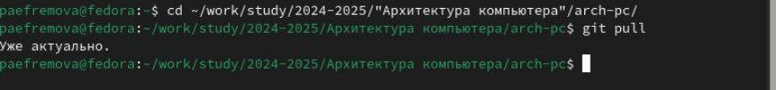
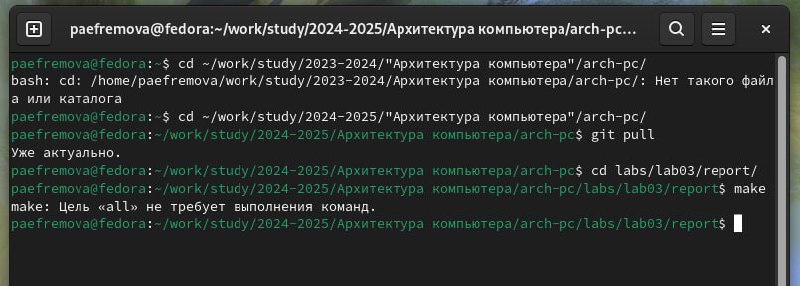
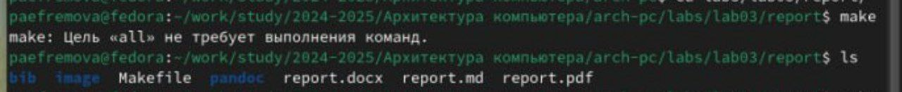
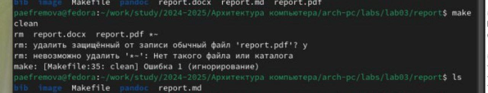
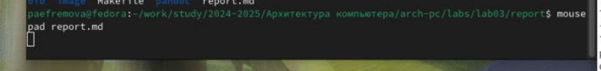
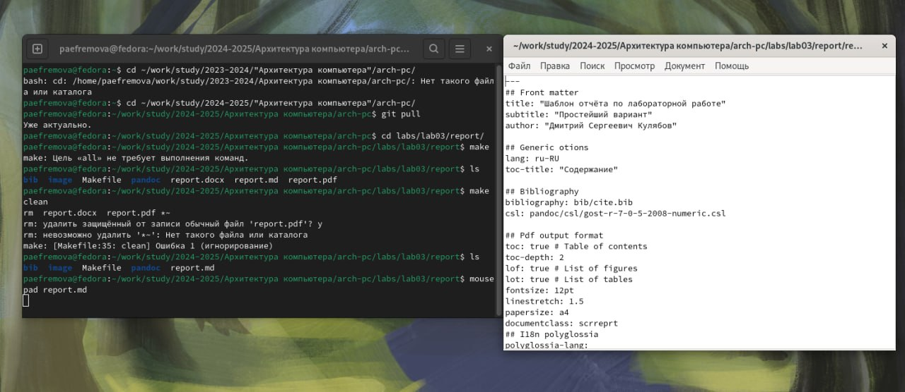

---
## Front matter
title: "Отчет по лабораторной работе № 3"
subtitle: "Дисциплина: Архитектура компьютера"
author: "Ефремова Полина Александровна"

## Generic otions
lang: ru-RU
toc-title: "Содержание"

## Bibliography
bibliography: bib/cite.bib
csl: pandoc/csl/gost-r-7-0-5-2008-numeric.csl

## Pdf output format
toc: true # Table of contents
toc-depth: 2
lof: true # List of figures
lot: true # List of tables
fontsize: 12pt
linestretch: 1.5
papersize: a4
documentclass: scrreprt
## I18n polyglossia
polyglossia-lang:
  name: russian
  options:
	- spelling=modern
	- babelshorthands=true
polyglossia-otherlangs:
  name: english
## I18n babel
babel-lang: russian
babel-otherlangs: english
## Fonts
mainfont: IBM Plex Serif
romanfont: IBM Plex Serif
sansfont: IBM Plex Sans
monofont: IBM Plex Mono
mathfont: STIX Two Math
mainfontoptions: Ligatures=Common,Ligatures=TeX,Scale=0.94
romanfontoptions: Ligatures=Common,Ligatures=TeX,Scale=0.94
sansfontoptions: Ligatures=Common,Ligatures=TeX,Scale=MatchLowercase,Scale=0.94
monofontoptions: Scale=MatchLowercase,Scale=0.94,FakeStretch=0.9
mathfontoptions:
## Biblatex
biblatex: true
biblio-style: "gost-numeric"
biblatexoptions:
  - parentracker=true
  - backend=biber
  - hyperref=auto
  - language=auto
  - autolang=other*
  - citestyle=gost-numeric
## Pandoc-crossref LaTeX customization
figureTitle: "Рис."
tableTitle: "Таблица"
listingTitle: "Листинг"
lofTitle: "Список иллюстраций"
lotTitle: "Список таблиц"
lolTitle: "Листинги"
## Misc options
indent: true
header-includes:
  - \usepackage{indentfirst}
  - \usepackage{float} # keep figures where there are in the text
  - \floatplacement{figure}{H} # keep figures where there are in the text
---

# Цель работы

Цель работы - освоение процедуры оформления отчетов с помощью легковесного
языка разметки Markdown.

# Задание

- Установка необходимого ПО
- Заполнение отчета по выполнению лабораторной работы №3 с помощью языка разметки Markdown
- Задание для самостоятельной работы

# Теоретическое введение

Markdown — облегчённый язык разметки, созданный с целью обозначения форматирования в простом тексте, 
с максимальным сохранением его читаемости человеком, и пригодный для машинного преобразования в языки 
для продвинутых публикаций (HTML, Rich Text и других).

# Выполнение лабораторной работы

## Установление необходимого ПО

Для выполнения рабораторной работы я установила необходимое программное обеспечение: textlife, pandoc и 
pandoc-crossref

## Заполнение отчета по выполнению лабораторной работы №3 с помощью языка разметки Markdown

Открываю терминал и перехожу в каталог курса сформированный при выполнении лабораторной работы
№2:(рис. [-@fig:001]).

{#fig:001 width=70%}

Ввожу команду git pull, чтобы скачать уведомления из удаленного репозитория:(рис. [-@fig:001]).

{#fig:001 width=70%}

Перехожу в каталог с шаблоном отчета по лабораторной работе № 3 и провожу компиляцию шаблона с использованием Makefile. 
Для этого ввожу команду make:(рис. [-@fig:001]).

{#fig:001 width=70%}
 
Проверю успешность компиляции с помощью команды ls:(рис. [-@fig:001]).

{#fig:001 width=70%} 

Удаляю полученные файлы с помощью команды make clean:(рис. [-@fig:001]).

{#fig:001 width=70%}

Проверяю, что файлы удалились с помощью команды ls:(рис. [-@fig:001]).

{#fig:001 width=70%}

Открываю файл для выполнения лабораторной работы с помощью команды mouse pad report.md:(рис. [-@fig:001]).

{#fig:001 width=70%}

Теперь начинаю выполнять отчет по выполнению лабораторной работы:(рис. [-@fig:001]).

{#fig:001 width=70%}

Загружаю файлы на GitHub

## Задания для самостоятельной работы

Аналогично выполнению отчета по текующей лабораторной работе, я выполняю отчет в markdown и по второй лабораторной работе, для этого перехожу в директорию 2 лабораторной работы и готовлю отчет с помощью текстового редактора mousepad. (рис. -@fig:006)

{#fig:006 width=70%}

Загружаю файл в трех форматах и передаю иноформацию на GitHub
# Выводы

В результате выполнения данной лабораторной работы я освоила процедуры оформления отчетов с помощью легковесного языка разметки Markdown.

# Список литературы

1. [Курс на ТУИС](https://esystem.rudn.ru/course/view.php?id=112)
2. 1. [Архитектура ЭВМ](https://esystem.rudn.ru/pluginfile.php/1584625/mod_resource/content/1/%D0%9B%D0%B0%D0%B1%D0%BE%D1%80%D0%B0%D1%82%D0%BE%D1%80%D0%BD%D0%B0%D1%8F%20%D1%80%D0%B0%D0%B1%D0%BE%D1%82%D0%B0%20%E2%84%964.pdf)
