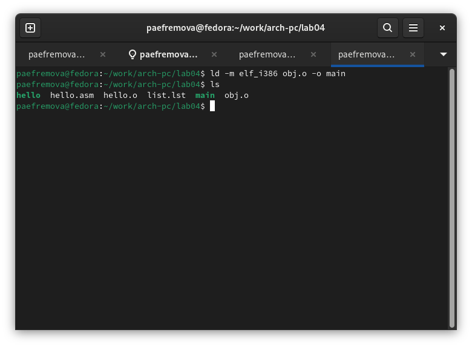

---
## Front matter
title: "Отчет по выполнению лабораторной работы  №4"
subtitle: "Дисциплина: Архитектура компьютера"
author: "Ефремова Полина Алекснадровна "

## Generic otions
lang: ru-RU
toc-title: "Содержание"

## Bibliography
bibliography: bib/cite.bib
csl: pandoc/csl/gost-r-7-0-5-2008-numeric.csl

## Pdf output format
toc: true # Table of contents
toc-depth: 2
lof: true # List of figures
lot: true # List of tables
fontsize: 12pt
linestretch: 1.5
papersize: a4
documentclass: scrreprt
## I18n polyglossia
polyglossia-lang:
  name: russian
  options:
	- spelling=modern
	- babelshorthands=true
polyglossia-otherlangs:
  name: english
## I18n babel
babel-lang: russian
babel-otherlangs: english
## Fonts
mainfont: IBM Plex Serif
romanfont: IBM Plex Serif
sansfont: IBM Plex Sans
monofont: IBM Plex Mono
mathfont: STIX Two Math
mainfontoptions: Ligatures=Common,Ligatures=TeX,Scale=0.94
romanfontoptions: Ligatures=Common,Ligatures=TeX,Scale=0.94
sansfontoptions: Ligatures=Common,Ligatures=TeX,Scale=MatchLowercase,Scale=0.94
monofontoptions: Scale=MatchLowercase,Scale=0.94,FakeStretch=0.9
mathfontoptions:
## Biblatex
biblatex: true
biblio-style: "gost-numeric"
biblatexoptions:
  - parentracker=true
  - backend=biber
  - hyperref=auto
  - language=auto
  - autolang=other*
  - citestyle=gost-numeric
## Pandoc-crossref LaTeX customization
figureTitle: "Рис."
tableTitle: "Таблица"
listingTitle: "Листинг"
lofTitle: "Список иллюстраций"
lotTitle: "Список таблиц"
lolTitle: "Листинги"
## Misc options
indent: true
header-includes:
  - \usepackage{indentfirst}
  - \usepackage{float} # keep figures where there are in the text
  - \floatplacement{figure}{H} # keep figures where there are in the text
---

# Цель работы

Освоение процедуры компиляции и сборки программ, написанных на ассемблере NASM.

с основными возможностями разметки Markdown.

# Задание

1. Знакомство с теоретической информацией (работа с языком "Ассемблер") 

2. Насписание команды 'Hello world!'

3. Научиться работать с шаблоном, чтобы создавать собственные команды. 

# Теоретическое введение

Ассемблер (англ. «Assembler») — это низкоуровневый язык программирования, который представляет собой промежуточное 
звено между машинным кодом и высокоуровневыми языками программирования. Он используется для написания программ, 
которые управляют компьютером или другими устройствами на более низком уровне, непосредственно взаимодействуя с 
аппаратным обеспечением. Код, написанный на этом языке, обычно сохраняется с помощью расширения ASM.

Директивы

В языке ассемблера директивы — это специальные инструкции. Они используются для предоставления дополнительной информации ассемблеру или компоновщику, а не выполняются как часть программы. Директивы обычно обозначают специальным символом, например точкой или решеткой.

`SECTION`: эта директива нужна для определения разделов программы, которые используют для группировки связанного кода и данных вместе.

`ORG`: чтобы установить исходный или начальный адрес программы или раздела.

`EQU`: чтобы определить константы или символы, которые используют во всей программе.

`DB`, `DW`, `DD`: для определения значений данных байтов, слов или двойных слов в памяти.

`ALIGN`: для выравнивания ячейки памяти следующей инструкции или значения данных с указанной границей.

`EXTERN`, `GLOBAL`: чтобы указать, определяется ли символ внешне или глобально. Эту информацию использует компоновщик для разрешения ссылок на символы в разных объектных файлах.

`INCLUDE`: для включения файла кода на языке ассемблера в текущую программу.

Директивы помогают управлять структурой и организацией программы на языке ассемблера, указывать дополнительную информацию для создания конечной исполняемой программы.

Команды

Команды языка ассемблера — основные строительные блоки программ. Эти инструкции используют, чтобы сообщить процессору, какие операции следует выполнять. В одних архитектурах сотни или тысячи различных инструкций, в других может быть всего несколько десятков.

Основные:

Команды перемещения данных. Перемещают данные между регистрами или ячейками памяти: MOV, PUSH и POP.

Арифметические команды. Выполняют арифметические операции с данными в регистрах или ячейках памяти: ADD, SUB и MUL.

Логические команды. Выполняют логические операции с данными в регистрах или ячейках памяти: AND, OR и XOR.

Команды ветвления. Управляют путем перехода к другому разделу кода: JMP, JZ и JE.

Команды стека. Управляют стеком — областью памяти для хранения данных — и управляющей информацией во время вызовов функций и возвратов: PUSH и POP.

Системные вызовы. Позволяют программам на ассемблере взаимодействовать с операционной системой или другими системными функциями, такими как INT, которые запускают программное прерывание.

Программирование на языке assembler не так распространено, как раньше. Но всё еще есть отрасли и приложения, где он нужен. Например, встроенные системы, разработка операционных систем и реверс-инжиниринг.

# Выполнение лабораторной работы

Создаю каталог для работы с программами на языке ассемблера (рис. -@fig:001)

{#fig:001 width=70%}

Перехожу в созданный каталог и создаю текстовый файл с именем hello.asm (рис. -@fig:002)

{#fig:002 width=70%}

Открываю созданный файл (рис. -@fig:003)

{#fig:003 width=70%}

(рис. -@fig:004)

{#fig:004 width=70%}

Для компиляции приведённого выше текста программы «Hello World» использую команду (рис. -@fig:005)

{#fig:005 width=70%}

Компилирую исходный файл hello.asm в obj.o (рис. -@fig:006)

{#fig:006 width=70%}

Передача объектного файла на работу компановщику (рис. -@fig:007)

{#fig:007 width=70%}

Выполняю еще одну команду (рис. -@fig:008)

{#fig:008 width=70%}

Запускаю на выполнение созданный файл (рис. -@fig:009)

{#fig:009 width=70%}

# Задание для самостоятельной работы 

Перехожу в нужный каталог (рис. -@fig:010)

{#fig:010 width=70%}

Создайю копию файла hello.asm с именем lab4.asm  и начинаю его редактировать (рис. -@fig:011)

{#fig:011 width=70%}

С помощью любого текстового редактора вношу изменения в текст программы в файле lab4 и вывожу полученный результат (рис. -@fig:012)

{#fig:012 width=70%}

Копирую файлы в свой локальный репозиторий (рис. -@fig:013)

![(image/13.png){#fig:013 width=70%}

Провожу загрузку на GitHub (рис. -@fig:014)

![(image/14.png){#fig:014 width=70%}

# Выводы

Данная лабораторная работа позволила мне познакомиться с таким языком как Ассемблер. Теперь я знаю как писать простейшие команды на данном языке через консоль. 
В заключение хочется отметить, что пцсть приведенный язык и не считается популярным, я все же убеждаюсь в его важности.

# Список литературы{.unnumbered}

[Ассемблер: что это за язык программирования, для чего нужен, пример кода] (https://sky.pro/media/chto-takoe-assembler/).

[Архитектура ЭВМ](https://esystem.rudn.ru/pluginfile.php/2089084/mod_resource/content/0/Лабораторная%20работа%20№4.%20Создание%20и%20процесс%20обработки%20программ%20на%20языке%20ассемблера%20NASM.pdf)

[Что такое язык ассемблера и кому его нужно изучать / Skillbox Media] (https://skillbox.ru/media/code/chto-takoe-assembler/)

::: {#refs}
:::
