---
## Front matter
title: "Отчет по выполнению лабораторной работы №5"
subtitle: "Дисциплина: архитектура компьютера"
author: "Ефремова Полина Александровна"

## Generic otions
lang: ru-RU
toc-title: "Содержание"

## Bibliography
bibliography: bib/cite.bib
csl: pandoc/csl/gost-r-7-0-5-2008-numeric.csl

## Pdf output format
toc: true # Table of contents
toc-depth: 2
lof: true # List of figures
lot: true # List of tables
fontsize: 12pt
linestretch: 1.5
papersize: a4
documentclass: scrreprt
## I18n polyglossia
polyglossia-lang:
  name: russian
  options:
	- spelling=modern
	- babelshorthands=true
polyglossia-otherlangs:
  name: english
## I18n babel
babel-lang: russian
babel-otherlangs: english
## Fonts
mainfont: IBM Plex Serif
romanfont: IBM Plex Serif
sansfont: IBM Plex Sans
monofont: IBM Plex Mono
mathfont: STIX Two Math
mainfontoptions: Ligatures=Common,Ligatures=TeX,Scale=0.94
romanfontoptions: Ligatures=Common,Ligatures=TeX,Scale=0.94
sansfontoptions: Ligatures=Common,Ligatures=TeX,Scale=MatchLowercase,Scale=0.94
monofontoptions: Scale=MatchLowercase,Scale=0.94,FakeStretch=0.9
mathfontoptions:
## Biblatex
biblatex: true
biblio-style: "gost-numeric"
biblatexoptions:
  - parentracker=true
  - backend=biber
  - hyperref=auto
  - language=auto
  - autolang=other*
  - citestyle=gost-numeric
## Pandoc-crossref LaTeX customization
figureTitle: "Рис."
tableTitle: "Таблица"
listingTitle: "Листинг"
lofTitle: "Список иллюстраций"
lotTitle: "Список таблиц"
lolTitle: "Листинги"
## Misc options
indent: true
header-includes:
  - \usepackage{indentfirst}
  - \usepackage{float} # keep figures where there are in the text
  - \floatplacement{figure}{H} # keep figures where there are in the text
---

# Цель работы

Цель данной работы - это приобретение практических навыков работы в Midnight Commander, а также освоение инструкций
языка ассемблера mov и int.

# Задание

1. Изучение основ работы с Midnight Commander.
2. Продолжение знакомства со структурой программы на языке ассемблера NASM.
3. Выполнение заданий для самостоятельной работы с целью закрепления материала. 

# Теоретическое введение

**Midnight Commander** *- популярный двухпанельный файловый менеджер, широко распространенный в UNIX-like операционных системах, он должен быть знаком каждому, кто хоть раз работал в консоли. Но, как показывает практика, не все администраторы в полной мере используют все возможности данного приложения, ограничиваясь только базовыми, что может приводить к определенным неудобствам. Поэтому сегодня ы расскажем о возможностях Midnight Commander и приемах, способных сделать работу в нем удобной и эффективной.

Основы навигации должны быть известны всем, но тем не менее повторимся: для перемещения внутри панелей следует использовать клавиши со стрелками, PageUp и PageDown прокручивают содержимое на размер экрана вверх или вниз, а Home и End перемещают в начало или конец списка, для переключения панелей используется Tab, сочетание клавиш Ctrl + o сворачивает панели и дает доступ к консоли, повторное нажатие этих же клавиш восстанавливает панели.

Нижнее меню предлагает ряд часто используемых действий, привязанных к функциональным клавишам Fn, цифра, написанная около пункта меню, обозначает номер функциональной клавиши, например, F5 - копирование, F8 - удаление. Клавиша F9 перемешает нас в верхнее меню менеджера, навигация по которому осуществляется с помощью клавиш со стрелками.

Разделы Левая панель и Правая панель верхнего меню идентичны и содержат настройки отображения панелей, также отсюда можно инициализировать внешнее FTP или SSH соединение, после чего панель будет отображать содержимое удаленного узла.*

Меню Файл содержит основные действия над файлами, здесь вы можете выполнить базовые действия над файлами, а также быстро изменить права, владельца, создать жесткую или символическую ссылку. Обратите внимание, около команд практически везде стоят сочетания клавиш, рекомендуем их запомнить, что позволит работать гораздо быстрее, не прибегая каждый раз к навигации по меню.

# Выполнение лабораторной работы

1. Скачиваю и открываю Midnight Commander (рис. [-@fig:001]).

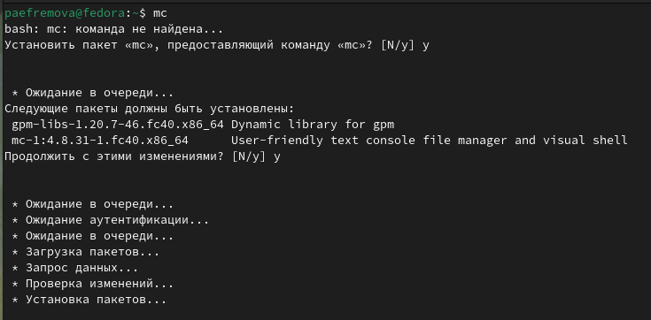{#fig:001 width=70%}

2. Перехожу в каталог arch-pc, созданный при выполнении прошлой лабораторной работы. Создаю каталог lab05. (рис. [-@fig:002]).

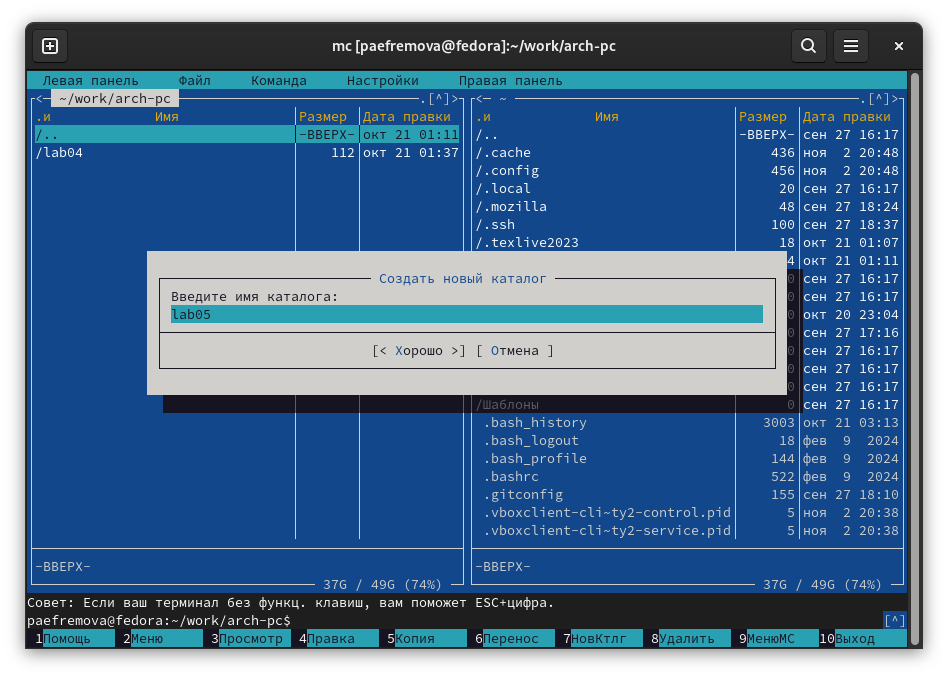{#fig:002 width=70%} 

3. С помощью команды touch создаю новый файл. (рис. [-@fig:003]).

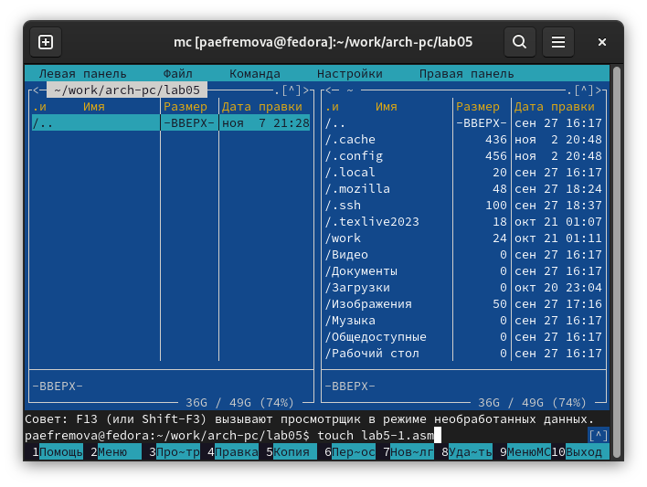{#fig:003 width=70%}

4. Открываю файл (рис. [-@fig:004]).

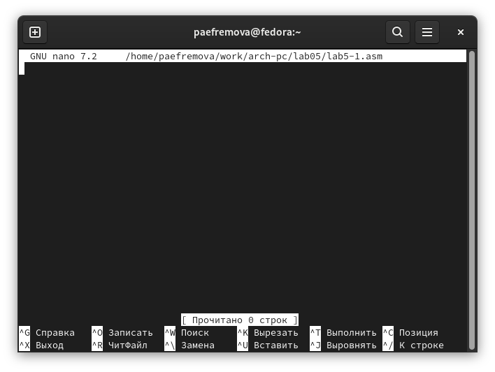{#fig:004 width=70%}

5. Ввожу текст программы из листинга 5.1, сохраняю изменения и закрываю файл. (рис. [-@fig:005]).

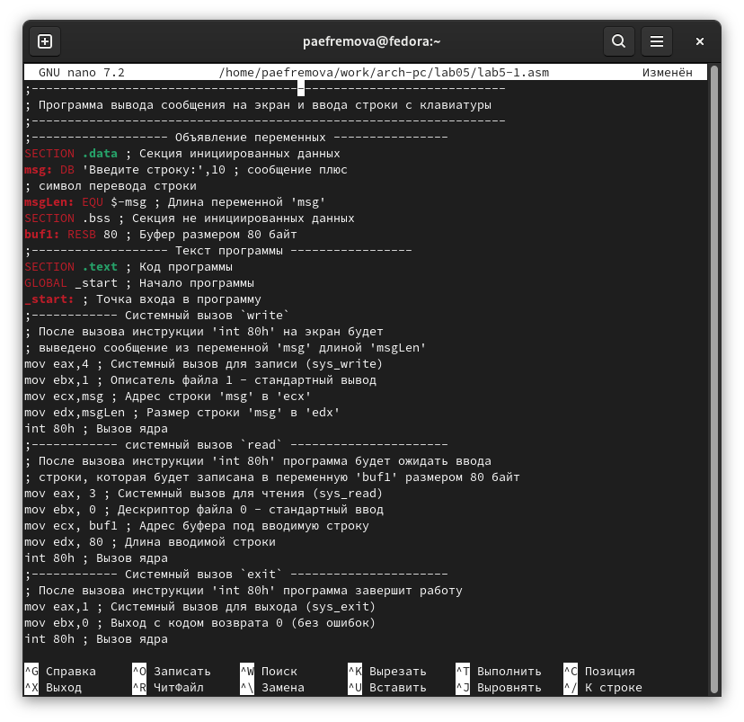{#fig:005 width=70%}

6. Оттранслирую текст программы lab5-1.asm в объектный файл. Выполня. компоновку объектного файла и запускаю получившийся исполняемый файл. (рис. [-@fig:006]).

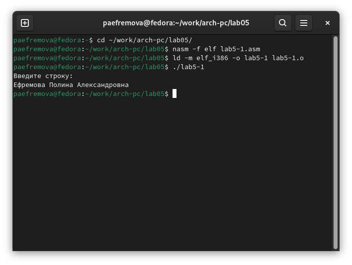{#fig:006 width=70%}

7. С помощью функциональной клавиши F6 создаю копию файла lab5-1.asm с именем lab5-2.asm. Выделяю файл lab5-1.asm, Нажмимаю клавишу F6 , ввожу имя файла lab5-2.asm и нажмимаю клавишу Enter. (рис. [-@fig:007]). 
 (рис. [-@fig:008]). 
 (рис. [-@fig:009]).

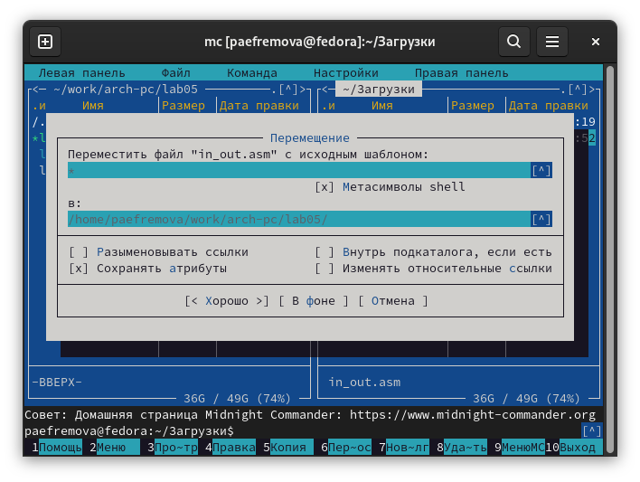{#fig:007 width=70%}

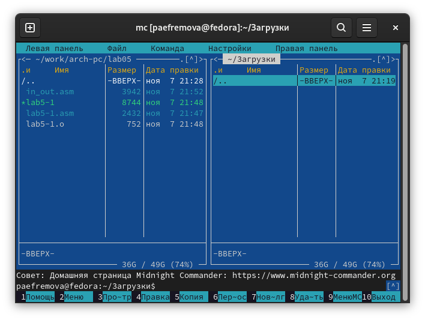{#fig:008 width=70%}

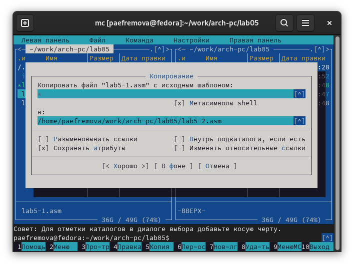{#fig:009 width=70%}

8.Исправляю текст программы в файле lab5-2.asm с использование подпрограмм из внешнего файла in_out.asm  в соответствии с листингом 5.2. (рис. [-@fig:010]).

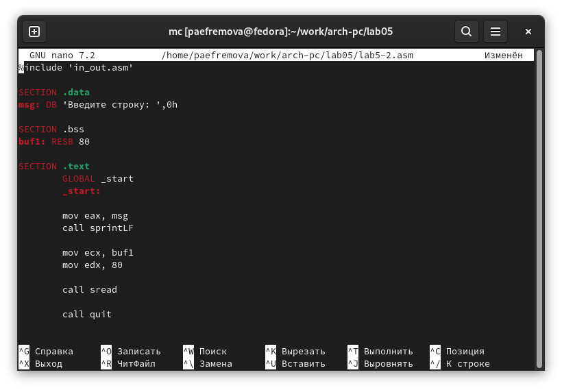{#fig:010 width=70%}

9.Создаю исполняемый файл и проверяю его работу. (рис. [-@fig:011]).

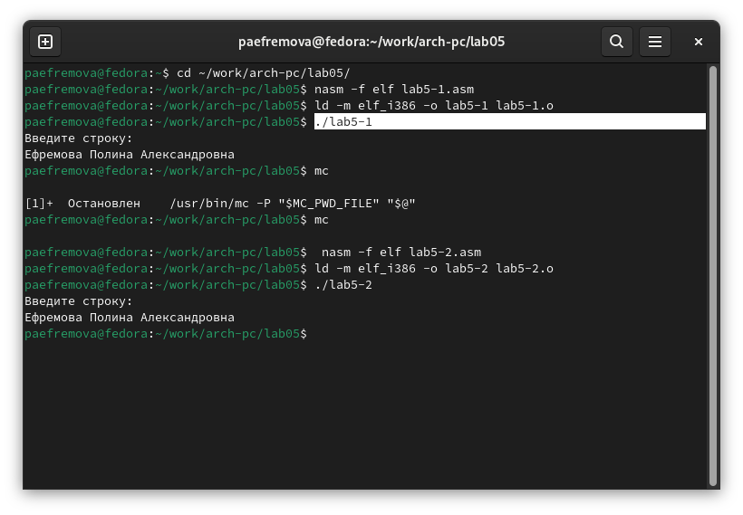{#fig:011 width=70%}

10. Заменив в файле подпрограмму sprintLF на sprint (рис. [-@fig:012]).

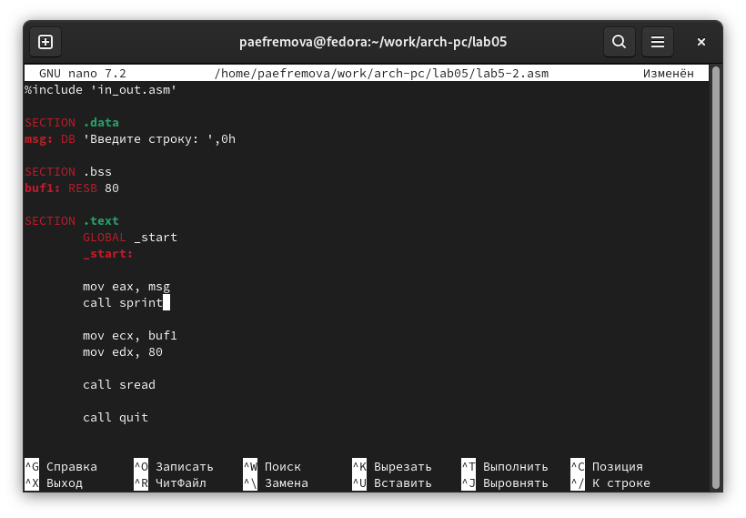{#fig:012 width=70%}

11.Понимаю, что теперь текст вводится в той же строке, что и запрос команды. (рис. [-@fig:013]).

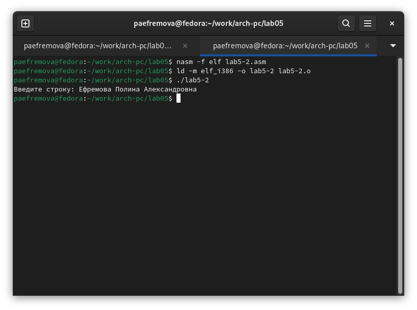{#fig:013 width=70%}

# Задание для самостоятельной работы

1. Создаю копию файла lab5-1.asm. (рис. [-@fig:014]).

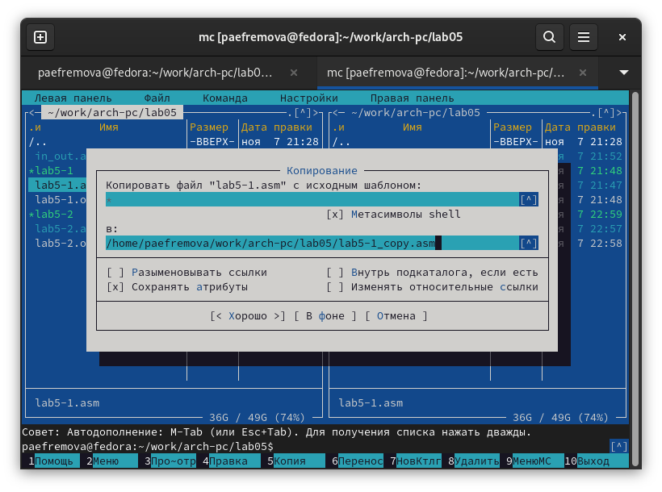{#fig:014 width=70%}

2. Вношу изменения в программу (без использования внешнего файла in_out.asm), так чтобы она работала по следующему алгоритму:
• вывести приглашение типа “Введите строку:”;
• ввести строку с клавиатуры;
• вывести введённую строку на экран.  (рис. [-@fig:015]).

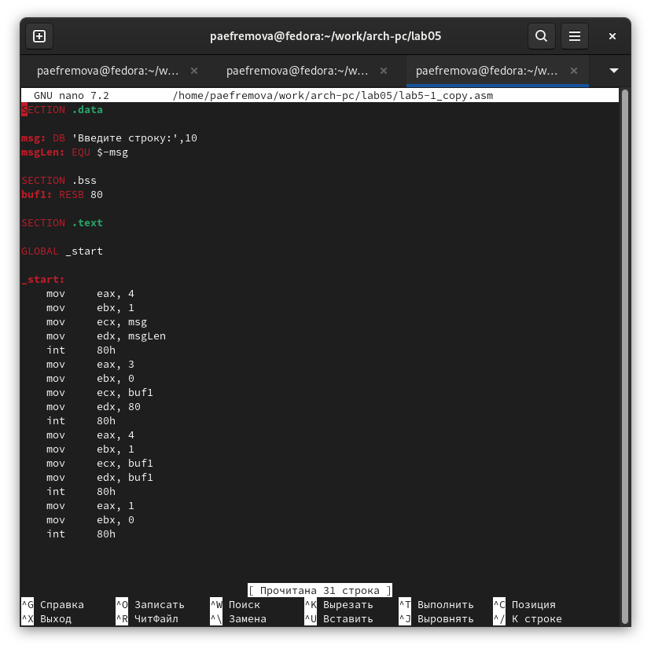{#fig:015 width=70%}

3. Получаю исполняемый файл и проверяю его работу. (рис. [-@fig:016]).

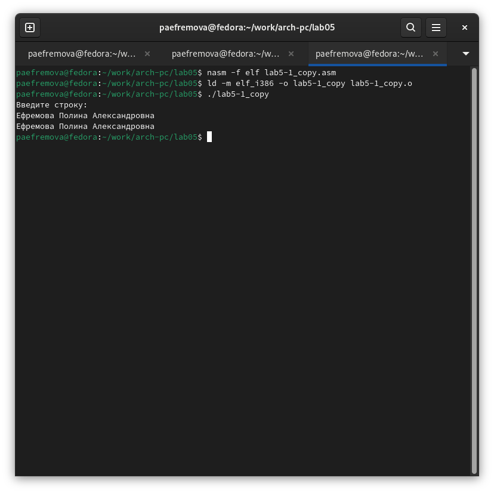{#fig:016 width=70%}

4. Создаю копию файла lab5-2.asm. (рис. [-@fig:017]).

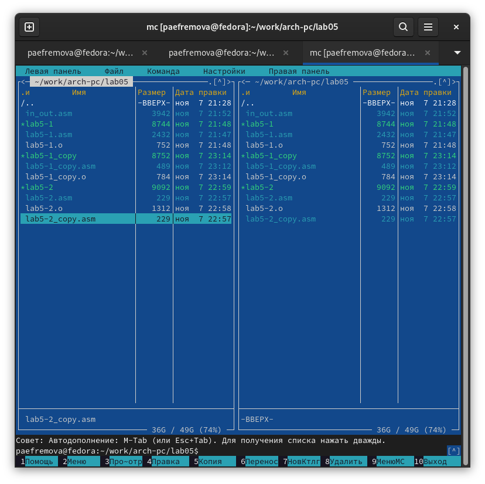{#fig:017 width=70%}

5.  Исправляю текст программы с использованием подпрограмм из внешнего файла in_out.asm, так чтобы она работала по следующему
алгоритму:
• вывести приглашение типа “Введите строку:”;
• ввести строку с клавиатуры;
• вывести введённую строку на экран. (рис. [-@fig:018]).

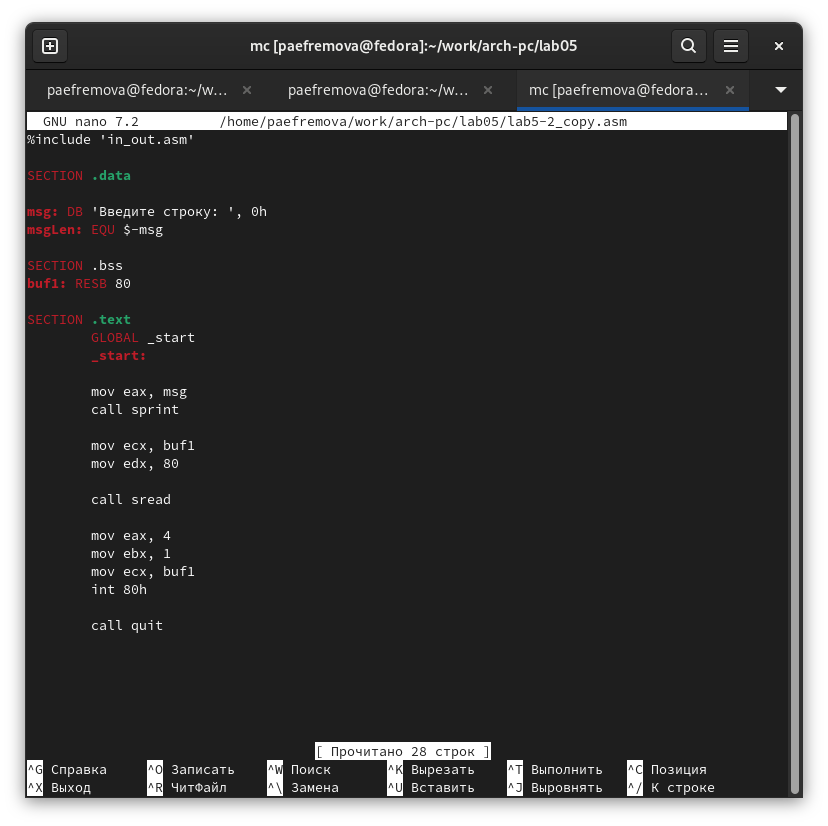{#fig:018 width=70%}

6. Получаю исполняемый файл и проверяю его работу. (рис. [-@fig:019]).

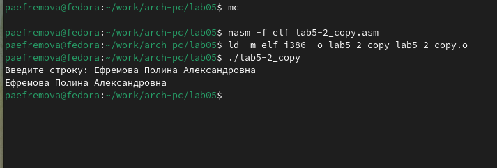{#fig:019 width=70%}

# Выводы

При выполнении данной лабораторной работы я получила большое количество теоретической информации относительно Midnight Commander, которую закрепила после, выполняя базовые команды. Кроме этого, я также освоила некоторые инструкции языка ассемблера. 

# Список литературы{.unnumbered}

1. [Лабораторная работа №5](https://esystem.rudn.ru/pluginfile.php/2089085/mod_resource/content/0/Лабораторная%20работа%20№5.%20Основы%20работы%20с%20Midnight%20Commander%20%28%29.%20Структура%20программы%20на%20языке%20ассемблера%20NASM.%20Системные%20вызовы%20в%20ОС%20GNU%20Linux.pdf)
2. [Осваиваем эффективную работу в Midnight Commander - Записки IT специалиста](https://interface31.ru/tech_it/2020/10/osvaivaem-effektivnuyu-rabotu-v-midnight-commander.html)

::: {#refs}
:::

 
