---
## Front matter
title: "Отчет по выполнению лабораторной работы №6"
subtitle: "Дисциплина: Архитетура компьютера"
author: "Ефремова Полина Александровна"

## Generic otions
lang: ru-RU
toc-title: "Содержание"

## Bibliography
bibliography: bib/cite.bib
csl: pandoc/csl/gost-r-7-0-5-2008-numeric.csl

## Pdf output format
toc: true # Table of contents
toc-depth: 2
lof: true # List of figures
lot: true # List of tables
fontsize: 12pt
linestretch: 1.5
papersize: a4
documentclass: scrreprt
## I18n polyglossia
polyglossia-lang:
  name: russian
  options:
	- spelling=modern
	- babelshorthands=true
polyglossia-otherlangs:
  name: english
## I18n babel
babel-lang: russian
babel-otherlangs: english
## Fonts
mainfont: IBM Plex Serif
romanfont: IBM Plex Serif
sansfont: IBM Plex Sans
monofont: IBM Plex Mono
mathfont: STIX Two Math
mainfontoptions: Ligatures=Common,Ligatures=TeX,Scale=0.94
romanfontoptions: Ligatures=Common,Ligatures=TeX,Scale=0.94
sansfontoptions: Ligatures=Common,Ligatures=TeX,Scale=MatchLowercase,Scale=0.94
monofontoptions: Scale=MatchLowercase,Scale=0.94,FakeStretch=0.9
mathfontoptions:
## Biblatex
biblatex: true
biblio-style: "gost-numeric"
biblatexoptions:
  - parentracker=true
  - backend=biber
  - hyperref=auto
  - language=auto
  - autolang=other*
  - citestyle=gost-numeric
## Pandoc-crossref LaTeX customization
figureTitle: "Рис."
tableTitle: "Таблица"
listingTitle: "Листинг"
lofTitle: "Список иллюстраций"
lotTitle: "Список таблиц"
lolTitle: "Листинги"
## Misc options
indent: true
header-includes:
  - \usepackage{indentfirst}
  - \usepackage{float} # keep figures where there are in the text
  - \floatplacement{figure}{H} # keep figures where there are in the text
---

# Цель работы

Основная цель данной лабораторной работы - освоение арифметических инструкций языка ассемблера NASM.

# Задание

1. Изучение теоретического материала по заданной теме
2. Определение существующих арифметических инструкций через ассемблер.
3. Работа с примерами кодов, решающих математические выражения.
4. Создание собственного кода.
 
# Теоретическое введение

Большинство инструкций на языке ассемблера требуют обработки операндов. Адрес операнда предоставляет место, где хранятся данные, подлежащие обработке. Это могут быть
данные хранящиеся в регистре или в ячейке памяти. Далее рассмотрены все существующие
способы задания адреса хранения операндов – способы адресации.

Существует три основных способа адресации:

• **Регистровая адресация** – операнды хранятся в регистрах и в команде используются
имена этих регистров, например: mov ax,bx.

• **Непосредственная адресация** – значение операнда задается непосредственно в команде, Например: mov ax,2.

• **Адресация памяти** – операнд задает адрес в памяти. В команде указывается символическое обозначение ячейки памяти, над содержимым которой требуется выполнить
операцию.

Поговорим про арифметические операции.

1) Схема команды целочисленного сложения add *(от англ. addition - добавление)* выполняет
сложение двух операндов и записывает результат по адресу первого операнда.

2) Команда целочисленного вычитания sub *(от англ. subtraction – вычитание)* работает аналогично команде add.

3) Довольно часто при написании программ встречается операция прибавления или вычитания единицы. Прибавление единицы называется инкрементом, а вычитание — декрементом.
Для этих операций существуют специальные команды: inc *(от англ. increment)* и dec *(от англ.
decrement)*, которые увеличивают и уменьшают на 1 свой операнд.

4) Команда neg рассматривает свой операнд как число со знаком и меняет знак операнда на
противоположный. Операндом может быть регистр или ячейка памяти любого размера.

5) Для беззнакового умножения используется команда mul *(от англ. multiply – умножение)*.Для знакового умножения используется команда imul.

6) Для деления, как и для умножения, существует 2 команды div *(от англ. divide - деление)* и idiv

# Выполнение лабораторной работы

##  Символьные и численные данные в NASM.

1. Создаю каталог для программам лабораторной работы № 6, перехожу в него и создаю файл lab6-1.asm (рис. [-@fig:001]).

{#fig:001 width=70%}

2. Ввожу в файл lab6-1.asm текст программы из листинга 6.1. (рис. [-@fig:002]).

{#fig:002 width=70%}

Ниже прикрепляю текст программы: 
```NASM
%include 'in_out.asm'
SECTION .bss
buf1: RESB 80
SECTION .text
GLOBAL _start
_start:
mov eax,'6'
mov ebx,'4'
add eax,ebx
mov [buf1],eax
mov eax,buf1
call sprintLF
call quit
```

3. Создаю исполняемый файл и запускаю его. (рис. [-@fig:003]).

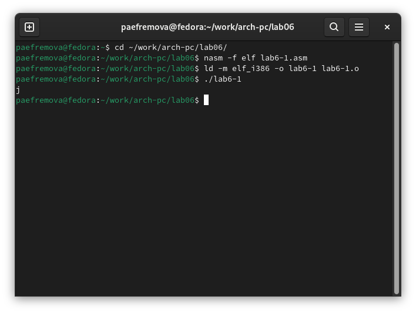{#fig:003 width=70%}

Вывод: В данном случае при выводе значения регистра eax вместо числа 10 мы видим символ j как разультат программы. 
Это происходит потому, что код символа 6 равен 00110110 в
двоичном представлении, а код символа 4 – 00110100.
Команда add eax,ebx запишет в регистр eax сумму кодов – 01101010 (106), что в свою
очередь является кодом символа j.

4. Далее изменяю текст программы и вместо символов записываю в регистры числа.(рис. [-@fig:004]).

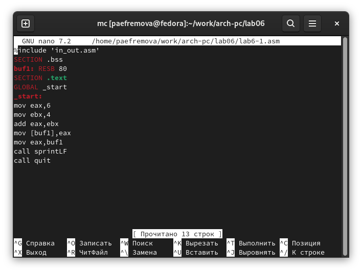{#fig:004 width=70%}

Текст программы:
```NASM
%include 'in_out.asm'
SECTION .bss
buf1: RESB 80
SECTION .text
GLOBAL _start
_start:
mov eax,'6'
mov ebx,'4'
add eax,ebx
mov [buf1],eax
mov eax,buf1
call sprintLF
call quit
```

5. Создаю исполняемый файл и запускаю его. (рис. [-@fig:005]).

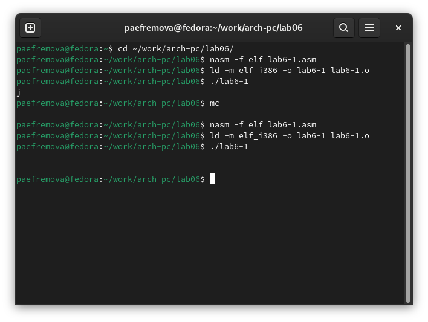{#fig:005 width=70%}

Вывод: Теперь вывелся символ с кодом 10, это символ перевода строки, этот символ не отображается при выводе на экран.

6. Создаю файл lab6-2.asm. (рис. [-@fig:006]).

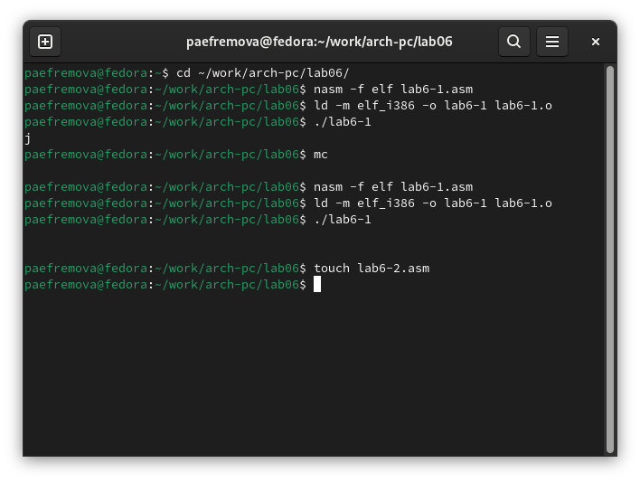{#fig:006 width=70%} 

7. Ввожу в файл 2 текст программы из листинга 6.2. (рис. [-@fig:007]).

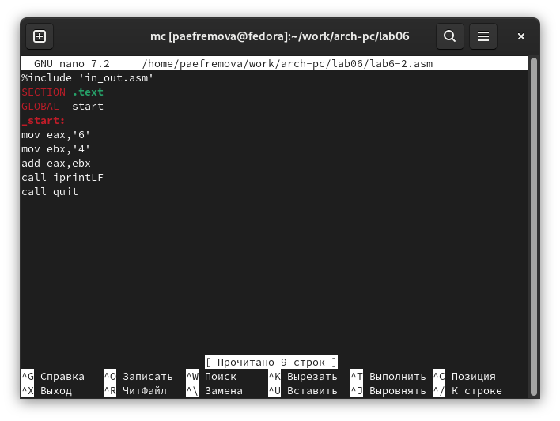{#fig:007 width=70%}

Текст программы вывода значения регистра eax. 
```NASM                 
%include 'in_out.asm'
SECTION .text
GLOBAL _start
_start:
mov eax,'6'
mov ebx,'4'
add eax,ebx
call iprintLF
call quit
```

8.  Создаю исполняемый файл 2 и запускаю его. (рис. [-@fig:008]).

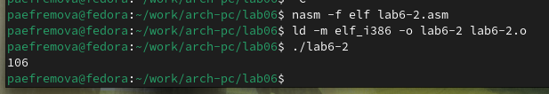{#fig:008 width=70%}

В результате работы данной программы я получила число 106. Данная программа схожа с предыдущей, только здесь iprintLF позволяет вывести число, а не символ, кодом которого
является это число. 

9. Аналогично предыдущему примеру изменяю символы на числа. (рис. [-@fig:009]).

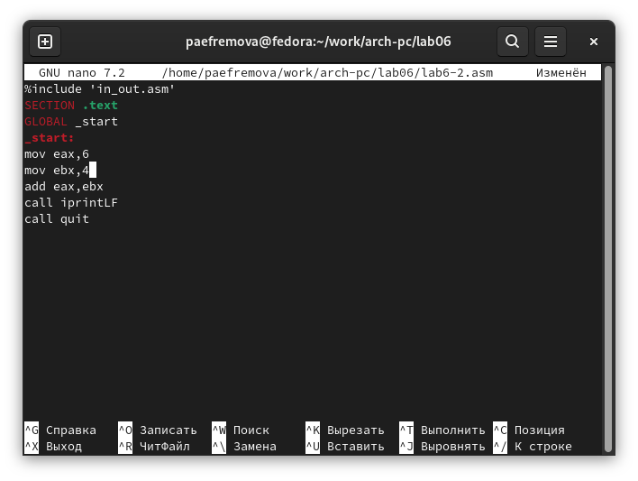{#fig:009 width=70%}

Текст измененной программы файла 2:
```NASM
%include 'in_out.asm'
SECTION .text
GLOBAL _start
_start:
mov eax,6
mov ebx,4
add eax,ebx
call iprintLF
call quit
```

10. Создаю исполняемый измененный файл 2 и запускаю его. (рис. [-@fig:010]).

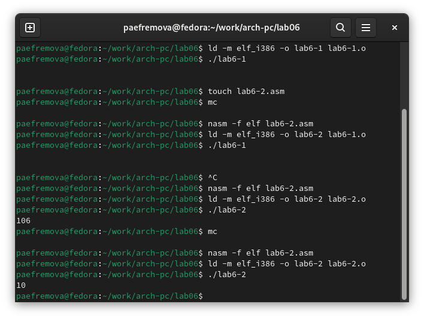{#fig:010 width=70%}

Вывод:  Теперь программа складывает не соответствующие символам коды в системе ASCII, а сами числа, поэтому вывод 10.

## Выполнение арифметических операций в NASM

11. Создаю файл lab6-3.asm в каталоге ~/work/arch-pc/lab06 (рис. [-@fig:011]).

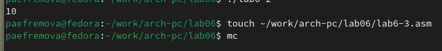{#fig:011 width=70%} 

12. Внимательно изучаю текст программы из листинга 6.3 и ввожу в lab6-3.asm (рис. [-@fig:012]).

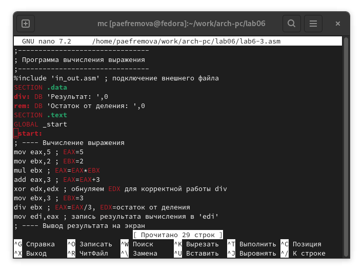{#fig:012 width=70%}

13. Создаю исполняемый файл 3 и запускаю его. (рис. [-@fig:013]).

{#fig:013 width=70%}

Текст программы 3: Программа вычисления выражения $𝑓(𝑥) = (5 ∗ 2 + 3)/3$ :
```NASM
%include 'in_out.asm' 
SECTION .data
div: DB 'Результат: ',0
rem: DB 'Остаток от деления: ',0
SECTION .text
GLOBAL _start
_start:
mov eax,5
mov ebx,2 
mul ebx 
add eax,3 
xor edx,edx 
mov ebx,3 
div ebx 
mov edi,eax 
mov eax,div 
call sprint 
mov eax,edi 
call iprintLF 
mov eax,rem 
call sprint 
mov eax,edx 
call iprintLF 
call quit 
```

14. Изменяю программу, чтобы она была способна вычислить выражение Программа вычисления выражения $𝑓(𝑥) = (4 ∗ 6 + 2)/5$ (рис. [-@fig:014]).

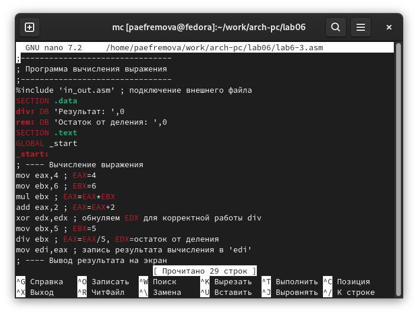{#fig:014 width=70%}

Текст измененной программы 3: Программа вычисления выражения $𝑓(𝑥) = (4 ∗ 6 + 2)/5$:
```NASM
%include 'in_out.asm' 
SECTION .data
div: DB 'Результат: ',0
rem: DB 'Остаток от деления: ',0
SECTION .text
GLOBAL _start
_start:
mov eax,4 
mov ebx,6
mul ebx 
add eax,2 
xor edx,edx 
mov ebx,5 
div ebx 
mov edi,eax 
mov eax,div 
call sprint 
mov eax,edi 
call iprintLF 
mov eax,rem 
call sprint 
mov eax,edx 
call iprintLF 
call quit 
```

15. Создаю исполняемый измененный файл 3 и запускаю его. (рис. [-@fig:015]).

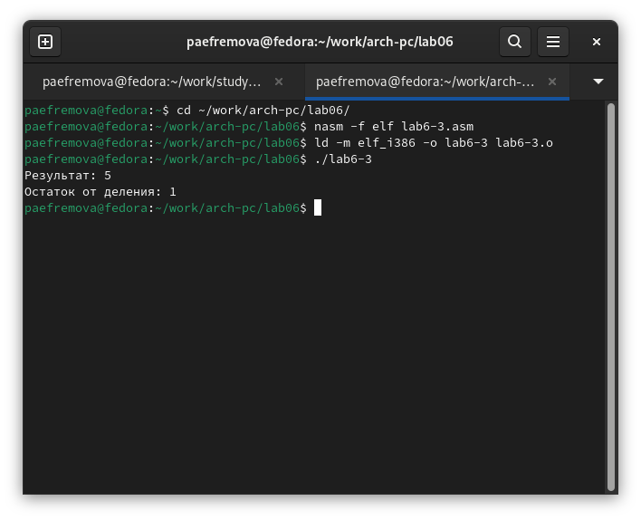{#fig:015 width=70%}

16. Создаю файл variant.asm в каталоге ~/work/arch-pc/lab06 (рис. [-@fig:016]).

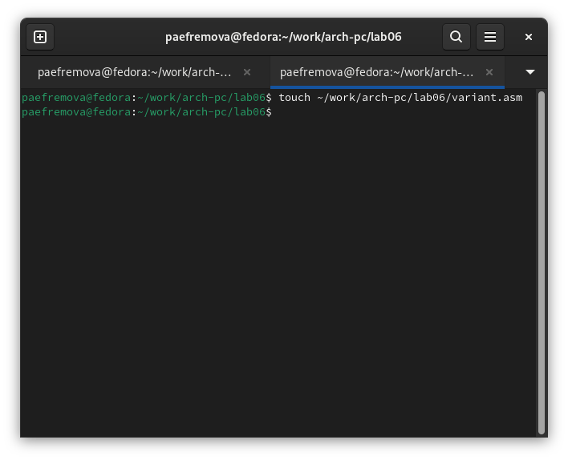{#fig:016 width=70%} 

17. Внимательно изучаю текст программы из листинга 6.4 и ввожу в файл variant.asm. (рис. [-@fig:017]).

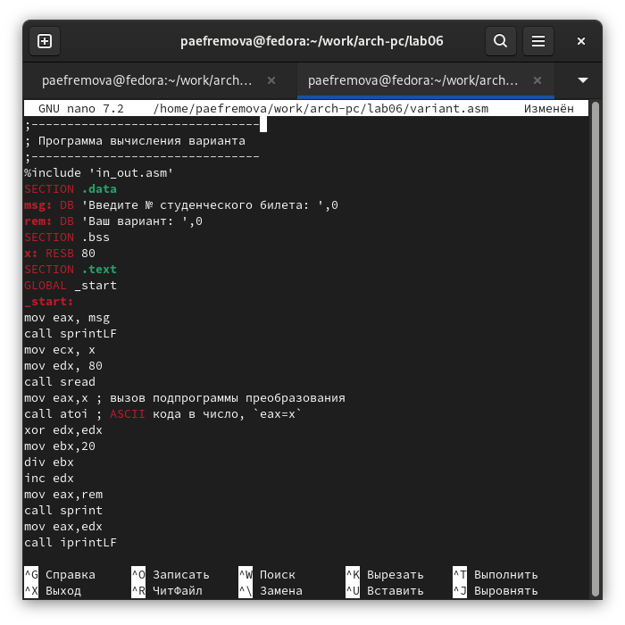{#fig:017 width=70%}

18.  Создаю исполняемый измененный файл и запускаю его. (рис. [-@fig:018]).

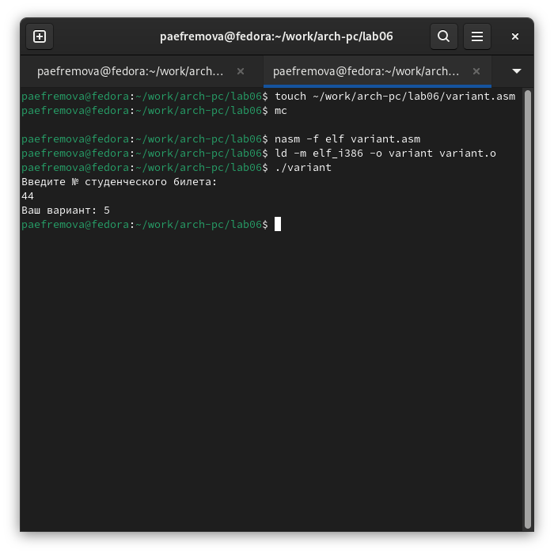{#fig:018 width=70%}

Программа показывает, чтов самостоятельной работе я буду писать программу для выражения из варианта 5. 

### Ответы на вопросы по программе

1. За вывод сообщения "Ваш вариант" отвечают строки кода:

```NASM
mov eax,rem
call sprint
```
2. Инструкция mov ecx, x используется, чтобы положить адрес вводимой строки x в регистр ecx
mov edx, 80 - запись в регистр edx длины вводимой строки 
call sread - вызов подпрограммы из внешнего файла, обеспечивающей ввод сообщения с клавиатуры  

3. call atoi используется для вызова подпрограммы из внешнего файла, которая преобразует ascii-код символа в целое число и записывает результат в регистр eax

4. За вычисления варианта отвечают строки:

```NASM
xor edx,edx ; обнуление edx для корректной работы div
mov ebx,20 ; ebx = 20
div ebx ; eax = eax/20, edx - остаток от деления
inc edx ; edx = edx + 1
```

5. При выполнении инструкции div ebx остаток от деления записывается в регистр edx

6. Инструкция inc edx увеличивает значение регистра edx на 1

7. За вывод на экран результатов вычислений отвечают строки:

```NASM
mov eax,edx
call iprintLF
```
## Выполнение заданий для самостоятельной работы.

1. Создаю файл lab6-4.asm в том же каталоге, что и другие файлы asm. (рис. [-@fig:019]).

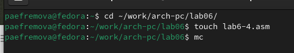{#fig:019 width=70%} 

2. Ввожу программу для выражения из варианта 5  $𝑓(𝑥)=(9𝑥 − 8)/8$ (рис. [-@fig:020]).

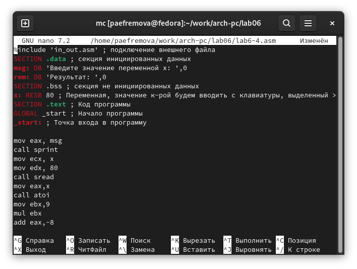{#fig:020 width=70%}

Текст программы из файла lab6-4.asm: 

```NASM
%include 'in_out.asm' ; подключение внешнего файла
SECTION .data ; секция инициированных данных
msg: DB 'Введите значение переменной х: ',0
rem: DB 'Результат: ',0
SECTION .bss ; секция не инициированных данных
x: RESB 80 ; Переменная, значение к-рой будем вводить с клавиатуры, выделенный >
SECTION .text ; Код программы
GLOBAL _start ; Начало программы
_start: ; Точка входа в программу

mov eax, msg
call sprint
mov ecx, x
mov edx, 80
call sread
mov eax,x
call atoi
mov ebx,9
mul ebx
add eax,-8
mov ebx, 8
div ebx
mov edi,eax ; запись результата вычисления в 'edi'

mov eax,rem ; вызов подпрограммы печати
call sprint ; сообщения 'Результат: '
mov eax,edi ; вызов подпрограммы печати значения
call iprint ; из 'edi' в виде символов
call quit ; вызов подпрограммы завершения
```

3.  Создаю исполняемый измененный файл и запускаю его, проверяю его работу для значений x1 и x2 из 6.3. (рис. [-@fig:021]).

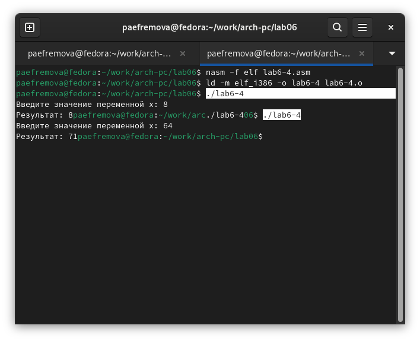{#fig:021 width=70%}

# Выводы

При выполнении данной лабораторной работы я освоила арифметические инструкции языка ассемблера NASM. 
Я увидела разницу между символьными и численными данными в NASM, научилась выполнять арифметические операции, а также сама смогла написать программу нахождения значения выражения. 

# Список литературы{.unnumbered}

1. [Архитектура ЭВМ](https://github.com/evdvorkina/study_2022-2023_arh-pc/blob/master/labs/lab07/report/Л07_Дворкина_отчет.md?plain=1)

2. [Синтаксис Markdown: подробная шпаргалка для веб-разработчиков / Skillbox Media](https://skillbox.ru/media/code/yazyk-razmetki-markdown-shpargalka-po-sintaksisu-s-primerami/)

3. [Руководство по NASM](https://www.opennet.ru/docs/RUS/nasm/nasm_ru3.html)

::: {#refs}
:::
