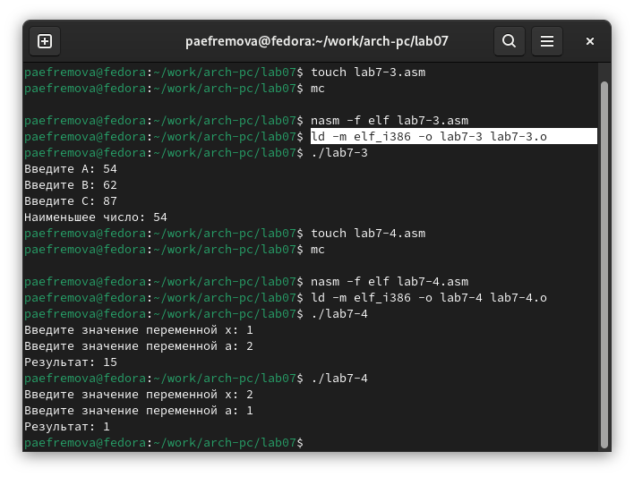

---
## Front matter
title: "Отчет по выполнению лабораторной работы №7"
subtitle: "Дисциплина: Архитектура компьютера"
author: "Ефремова Полина Александровна"

## Generic otions
lang: ru-RU
toc-title: "Содержание"

## Bibliography
bibliography: bib/cite.bib
csl: pandoc/csl/gost-r-7-0-5-2008-numeric.csl

## Pdf output format
toc: true # Table of contents
toc-depth: 2
lof: true # List of figures
lot: true # List of tables
fontsize: 12pt
linestretch: 1.5
papersize: a4
documentclass: scrreprt
## I18n polyglossia
polyglossia-lang:
  name: russian
  options:
	- spelling=modern
	- babelshorthands=true
polyglossia-otherlangs:
  name: english
## I18n babel
babel-lang: russian
babel-otherlangs: english
## Fonts
mainfont: IBM Plex Serif
romanfont: IBM Plex Serif
sansfont: IBM Plex Sans
monofont: IBM Plex Mono
mathfont: STIX Two Math
mainfontoptions: Ligatures=Common,Ligatures=TeX,Scale=0.94
romanfontoptions: Ligatures=Common,Ligatures=TeX,Scale=0.94
sansfontoptions: Ligatures=Common,Ligatures=TeX,Scale=MatchLowercase,Scale=0.94
monofontoptions: Scale=MatchLowercase,Scale=0.94,FakeStretch=0.9
mathfontoptions:
## Biblatex
biblatex: true
biblio-style: "gost-numeric"
biblatexoptions:
  - parentracker=true
  - backend=biber
  - hyperref=auto
  - language=auto
  - autolang=other*
  - citestyle=gost-numeric
## Pandoc-crossref LaTeX customization
figureTitle: "Рис."
tableTitle: "Таблица"
listingTitle: "Листинг"
lofTitle: "Список иллюстраций"
lotTitle: "Список таблиц"
lolTitle: "Листинги"
## Misc options
indent: true
header-includes:
  - \usepackage{indentfirst}
  - \usepackage{float} # keep figures where there are in the text
  - \floatplacement{figure}{H} # keep figures where there are in the text
---

# Цель работы

Цеоль данной работы - изучить команды условного и безусловного переходов. Кроме этого, - приобрести навыки написания
программ с использованием переходов, а также познакомиться с назначением и структурой файла листинга.

# Задание

1. Реализовать переходы в NASM

2. Изучить структуру файлов листинга

3. Выполнить 2 задания для самостоятельной работы: написать программы для решения функции и для нахождения минимального значения среди чисел. 

# Теоретическое введение

Выделяют 2 типа переходов/команд передачи управления в ассемблере для реализации ветвления:

*• условный переход – выполнение или не выполнение перехода в определенную точку программы в зависимости от проверки условия.*

*• безусловный переход – выполнение передачи управления в определенную точку программы без каких-либо условий.*

## Команды безусловного перехода

Безусловный переход выполняется инструкцией **jmp (от англ. jump – прыжок)**, которая
включает в себя адрес перехода, куда следует передать управление.

## Команды условного перехода

Для условного перехода необходима проверка какого-либо условия.
В ассемблере команды условного перехода вычисляют условие перехода анализируя флаги
из регистра флагов.

#### Регистр флагов

Флаг – это бит, принимающий значение 1 («флаг установлен»), если выполнено некоторое
условие, и значение 0 («флаг сброшен») в противном случае. Флаги работают независимо
друг от друга, и лишь для удобства они помещены в единый регистр — регистр флагов, отражающий текущее состояние процессора.

Флаги состояния (биты 0, 2, 4, 6, 7 и 11) отражают результат выполнения арифметических
инструкций, таких как ADD, SUB, MUL, DIV.

#### Описание инструкции cmp

Инструкция cmp является одной из инструкций, которая позволяет сравнить операнды и
выставляет флаги в зависимости от результата сравнения.
Инструкция cmp является командой сравнения двух операндов и имеет такой же формат,
как и команда вычитания.

Команда cmp, так же как и команда вычитания, выполняет вычитание <операнд_2> -
<операнд_1>, но результат вычитания никуда не записывается и единственным результатом
команды сравнения является формирование флагов.

Команда условного перехода имеет вид:

**j<мнемоника перехода> label**

Мнемоника перехода связана со значением анализируемых флагов или со способом формирования этих флагов.

#### Файл листинга и его структура

Листинг (в рамках понятийного аппарата NASM) — это один из выходных файлов, создаваемых транслятором. Он имеет текстовый вид и нужен при отладке программы, так как
кроме строк самой программы он содержит дополнительную информацию.

Cтруктура листинга:

• *номер строки* — это номер строки файла листинга (нужно помнить, что номер строки в
файле листинга может не соответствовать номеру строки в файле с исходным текстом
программы);
• *адрес* — это смещение машинного кода от начала текущего сегмента;
• машинный код представляет собой ассемблированную исходную строку в виде шестнадцатеричной последовательности. (например, инструкция int 80h начинается по смещению 00000020 в сегменте кода; далее идёт машинный код, в который ассемблируется
инструкция, то есть инструкция int 80h ассемблируется в CD80 (в шестнадцатеричном
представлении); CD80 — это инструкция на машинном языке, вызывающая прерывание
ядра);
• *исходный текст программы* — это просто строка исходной программы вместе с комментариями (некоторые строки на языке ассемблера, например, строки, содержащие
только комментарии, не генерируют никакого машинного кода, и поля «смещение» и
«исходный текст программы» в таких строках отсутствуют, однако номер строки им
присваивается).

# Выполнение лабораторной работы

1. Создаю файл lab7-1.asm (рис. [-@fig:001]).

{#fig:001 width=70%}

2. Ввожу в файл lab7-1.asm программу (рис. [-@fig:002]).

Листинг 7.1. Программа с использованием инструкции jmp

```NASM
%include 'in_out.asm' 

SECTION .data
msg1: DB 'Сообщение № 1',0
msg2: DB 'Сообщение № 2',0
msg3: DB 'Сообщение № 3',0

SECTION .text
GLOBAL _start
_start:

jmp _label2

_label1:
mov eax, msg1 
call sprintLF 

_label2:
mov eax, msg2 
call sprintLF 

label3:
mov eax, msg3 
call sprintLF 

_end:
call quit 
```

{#fig:002 width=70%}

3. Запускаю файл lab7-1.asm (рис. [-@fig:003]).

{#fig:003 width=70%}

4. Создаю копию файла и вношу в него изменения (рис. [-@fig:004]).

{#fig:004 width=70%}

Листинг 7.2. Программа с использованием инструкции jmp

```NASM
%include 'in_out.asm' 

SECTION .data
msg1: DB 'Сообщение № 1',0
msg2: DB 'Сообщение № 2',0
msg3: DB 'Сообщение № 3',0

SECTION .text

GLOBAL _start
_start:
jmp _label2

_label1:
mov eax, msg1 
call sprintLF 
jmp _end

_label2:
mov eax, msg2 
call sprintLF 
jmp _label1

_label3:
mov eax, msg3 
call sprintLF 

_end:
call quit 
```

5. Запуск измененного файла (рис. [-@fig:005]).

{#fig:005 width=70%}

6. В этом же файле переделываю команды так, чтобы сообщения выводились иным образом (рис. [-@fig:006]).

{#fig:006 width=70%}

Измененный мной листинг:

 ```NASM
%include 'in_out.asm' 

SECTION .data
msg1: DB 'Сообщение № 1',0
msg2: DB 'Сообщение № 2',0
msg3: DB 'Сообщение № 3',0

SECTION .text
GLOBAL _start
_start:
jmp _label3

_label1:
mov eax, msg1 
call sprintLF 
jmp _end

_label2:
mov eax, msg2 
call sprintLF 
jmp _label1

_label3:
mov eax, msg3 
call sprintLF 
jmp _label2

_end:
call quit 
```


7. Запускаю измененный файл (рис. [-@fig:007]).

{#fig:007 width=70%}

8. Создаю файл lab7-2.asm (рис. [-@fig:008]).

{#fig:008 width=70%}

9. Ввожу в файл программу из листинга 7.3. (рис. [-@fig:009]).

Листинг 7.3. Программа, которая определяет и выводит на экран наибольшую из 3
целочисленных переменных: A,B и C.

```NASM
%include 'in_out.asm'

section .data
msg1 db 'Введите B: ',0h
msg2 db "Наибольшее число: ",0h
A dd '20'
C dd '50'
section .bss
max resb 10
B resb 10
section .text
global _start
_start:

mov eax,msg1
call sprint

mov ecx,B
mov edx,10
call sread

mov eax,B
call atoi ; Вызов подпрограммы перевода символа в число
mov [B],eax ; запись преобразованного числа в 'B'

mov ecx,[A] ; 'ecx = A'
mov [max],ecx ; 'max = A'

cmp ecx,[C] ; Сравниваем 'A' и 'С'
jg check_B ; если 'A>C', то переход на метку 'check_B',
mov ecx,[C] ; иначе 'ecx = C'
mov [max],ecx ; 'max = C'

check_B:
mov eax,max
call atoi
mov [max],eax 
; ---------- Сравниваем 'max(A,C)' и 'B' (как числа)
mov ecx,[max]
cmp ecx,[B] 
jg fin 
mov ecx,[B] 
mov [max],ecx

fin:
mov eax, msg2
call sprint 
mov eax,[max]
call iprintLF 
call quit 
```

{#fig:009 width=70%}

10. Запуск программы из листинга 7.3. (рис. [-@fig:010]).

{#fig:010 width=70%}

11. Создаю файл листинга программы 2. (рис. [-@fig:011]).

{#fig:011 width=70%}

12. Открываю созданный файл (рис. [-@fig:012]).

{#fig:012 width=70%}

Изучение листинга, объяснение трех строк из данного файла: 

Описание строки 1: вижу, что программа передает код из файла in_out.asm. Т.е. в данном файле показан тот код, 
который мы включили в asm файл.

Описание строки 4: 4 - номер строки, 00000000 - смещение машинного кода относительно начала текущего сегмента, 
53 - машинный код,   push    ebx - текст программы.

Описание строки 49: 49 - номер строки, 00000167 - смещение машинного кода относительно начала текущего сегмента, 
E86FFFFFFF - машинный код, call quit - текст программы, ; Выход - комментарий. 

13. Открываю файл с программой lab7-2.asm и удаляю 1 операнд со сторки (на скриншоте есть курсив, там и удалила) (рис. [-@fig:013]).

{#fig:013 width=70%}

14. Консоль выдает ошибку (рис. [-@fig:014]).

{#fig:014 width=70%}

15. В листинге также появляется ошибка, при этом другие файлы не создаются. (рис. [-@fig:015]).

{#fig:015 width=70%}

# Выполнение заданий для самостоятельной работы

1. Создаю файл lab7-3.asm для работы. (рис. [-@fig:016]).

{#fig:016 width=70%}

Ввожу в файл программу (рис. [-@fig:017]).

Программа для самостоятельной работы 1: 

```NASM
%include 'in_out.asm'
section .data
msg2 db 'Введите A: ', 0h
msg db 'Введите B: ', 0h
msg3 db 'Введите C: ', 0h
msg1 db 'Наименьшее число: ',0h

section .bss
min resb 10
A resb 10
B resb 10
C resb 10

section .text
global _start
_start:

mov eax, msg2
call sprint

mov ecx, A
mov edx, 10
call sread

mov eax, msg
call sprint

mov ecx, B
mov edx, 10
call sread

mov eax, msg3
call sprint

mov ecx, C
mov edx, 10
call sread


mov eax,A
call atoi 
mov [A],eax 

mov eax,B
call atoi 
mov [B],eax 

mov eax,C
call atoi 
mov [C],eax 

mov ecx,[A] ; ecx = A
mov [min],ecx ; min = A

cmp ecx,[C] ; A ? C
jb check_B ; if A < C |-> check_B
mov ecx,[C] ; if A > C |-> ecx = C
mov [min],ecx ; min = C

check_B:
mov ecx,[min] ; ecx = min(A/C)
cmp ecx,[B] ; A/C ? B
jb fin ; if A/C < B |-> fin
mov ecx,[B] ; if A/C > B |-> ecx = B
mov [min],ecx ; min = B

fin:
mov eax, msg1 ; eax = msg1
call sprint ; вывод
mov eax,[min] ; eax = min
call iprintLF ; вывод
call quit
```

{#fig:017 width=70%}

Запуск программы (рис. [-@fig:018]).

{#fig:018 width=70%}

2.Создаю файл для второго самостоятельного задания и ввожу туда программу (рис. [-@fig:019]).

{#fig:019 width=70%}

Программа для задания 2:

```NASM
%include 'in_out.asm'
SECTION .data
msg1: DB 'Введите значение переменной x: ',0
msg2: DB 'Введите значение переменной a: ',0
res: DB 'Результат: ',0
SECTION .bss
x: RESB 80
a: RESB 80
SECTION .text
GLOBAL _start
_start:


mov eax, msg1
call sprint
mov ecx, x
mov edx, 80
call sread
mov eax,x
call atoi
mov edi,eax ; edi = x 

mov eax, msg2
call sprint
mov ecx, a
mov edx, 80
call sread
mov eax,a
call atoi
mov esi,eax ; esi = a


cmp edi,esi
jg var2 ; a < x |-> var2

mov eax,x
call atoi

mov edi,15 ; edi = 15
jmp fin

var2:
mov eax,x
call atoi ; x
sub eax, esi; x - a
mov ebx, 2 ; ebx = 2
mul eax ; (x-a)*2
mov edi, eax ; edi = aex


fin:
mov eax,res ; eax = res
call sprint ; строка
mov eax,edi ; eax = edi
call iprintLF
call quit
```

Запуск программы (рис. [-@fig:020]).

{#fig:020 width=70%}

# Выводы

При выполнении лабораторной работы я изучила команды условных и безусловных переходво, а также приобрела навыки написания программ с использованием перходов, познакомилась
с назначением и структурой файлов листинга.


# Список литературы{.unnumbered}

1.[Архитектура ЭВМ](https://esystem.rudn.ru/pluginfile.php/2089087/mod_resource/content/0/Лабораторная%20работа%20№7.%20Команды%20безусловного%20и%20условного%20переходов%20в%20Nasm.%20Программирование%20ветвлений..pdf)

2.[Архитектура ЭВМ](https://esystem.rudn.ru/pluginfile.php/2089086/mod_resource/content/0/Лабораторная%20работа%20№6.%20Арифметические%20операции%20в%20NASM..pdf)


::: {#refs}
:::
