---
## Front matter
title: "Выпоолнение лабораторной работы №8"
subtitle: "Дисциплина: Архитектура компьютера"
author: "Ефремова Полина Александровна"

## Generic otions
lang: ru-RU
toc-title: "Содержание"

## Bibliography
bibliography: bib/cite.bib
csl: pandoc/csl/gost-r-7-0-5-2008-numeric.csl

## Pdf output format
toc: true # Table of contents
toc-depth: 2
lof: true # List of figures
lot: true # List of tables
fontsize: 12pt
linestretch: 1.5
papersize: a4
documentclass: scrreprt
## I18n polyglossia
polyglossia-lang:
  name: russian
  options:
	- spelling=modern
	- babelshorthands=true
polyglossia-otherlangs:
  name: english
## I18n babel
babel-lang: russian
babel-otherlangs: english
## Fonts
mainfont: IBM Plex Serif
romanfont: IBM Plex Serif
sansfont: IBM Plex Sans
monofont: IBM Plex Mono
mathfont: STIX Two Math
mainfontoptions: Ligatures=Common,Ligatures=TeX,Scale=0.94
romanfontoptions: Ligatures=Common,Ligatures=TeX,Scale=0.94
sansfontoptions: Ligatures=Common,Ligatures=TeX,Scale=MatchLowercase,Scale=0.94
monofontoptions: Scale=MatchLowercase,Scale=0.94,FakeStretch=0.9
mathfontoptions:
## Biblatex
biblatex: true
biblio-style: "gost-numeric"
biblatexoptions:
  - parentracker=true
  - backend=biber
  - hyperref=auto
  - language=auto
  - autolang=other*
  - citestyle=gost-numeric
## Pandoc-crossref LaTeX customization
figureTitle: "Рис."
tableTitle: "Таблица"
listingTitle: "Листинг"
lofTitle: "Список иллюстраций"
lotTitle: "Список таблиц"
lolTitle: "Листинги"
## Misc options
indent: true
header-includes:
  - \usepackage{indentfirst}
  - \usepackage{float} # keep figures where there are in the text
  - \floatplacement{figure}{H} # keep figures where there are in the text
---

# Цель работы

Приобрести навыки написания программ с использованием циклов и обработкой аргументов командной строки.

# Задание

1. Изучение теории на заданную тему.
2. Практика с использованием предложенных листингов. 
3. Практика с самостоятельным написанием программы.

# Теоретическое введение

### Что такое стек в ассемблере?

Работа процедур тесно связана со стеком. Стеком называется область программы для временного хранения данных. Стек в ассемблере работает по правилу «Первым зашёл — последним вышел, последним зашёл — первым вышел». В любой период времени в стеке доступен только первый элемент, то есть элемент, загруженный в стек последним. Выгрузка из стека верхнего элемента делает доступным следующий элемент. Это напоминает ящик, в который поочерёдно ложатся книги. Чтобы получить доступ к книге, которую положили первой, необходимо достать поочерёдно все книги, лежащие сверху. Элементы стека располагаются в специально выделенной под стек области памяти, начиная со дна стека по последовательно уменьшающимся адресам. Адрес верхнего доступного элемента хранится в регистре-указателе стека SP. Стек может входить в какой-либо сегмент или быть отдельным сегментом. Сегментный адрес стека помещается в сегментный регистр SS. Пара регистров SS:SP образует адрес доступной ячейки стека.

Работа со стеком осуществляется с помощью команд PUSH и POP.

Примеры для PUSH и POP:

```NASM
push cs;значение cs можно затолкать в стек
push bx
push ax

pop ax
pop bx
pop ax;а вот изменить значение cs нельзя (pop cs - ошибка)!
```

## Добавление элемента в стек.
Команда push размещает значение в стеке, т.е. помещает значение в ячейку памяти, на
которую указывает регистр esp, после этого значение регистра esp увеличивается на 4.
Данная команда имеет один операнд — значение, которое необходимо поместить в стек.

Существует ещё две команды для добавления значений в стек. Это команда pusha, которая
помещает в стек содержимое всех регистров общего назначения в следующем порядке: ах,
сх, dx, bх, sp, bp, si, di. А также команда pushf, которая служит для перемещения в стек
содержимого регистра флагов. Обе эти команды не имеют операндов.

## Извлечение элемента из стека.
Команда pop извлекает значение из стека, т.е. извлекает значение из ячейки памяти, на
которую указывает регистр esp, после этого уменьшает значение регистра esp на 4. У этой
команды также один операнд, который может быть регистром или переменной в памяти.
Нужно помнить, что извлечённый из стека элемент не стирается из памяти и остаётся как
“мусор”, который будет перезаписан при записи нового значения в стек.

## Инструкции организации циклов
Для организации циклов существуют специальные инструкции. Для всех инструкций
максимальное количество проходов задаётся в регистре ecx. Наиболее простой является инструкция loop. Она позволяет организовать безусловный цикл

Иструкция loop выполняется в два этапа. Сначала из регистра ecx вычитается единица и
его значение сравнивается с нулём. Если регистр не равен нулю, то выполняется переход к
указанной метке. Иначе переход не выполняется и управление передаётся команде, которая
следует сразу после команды loop.

# Выполнение лабораторной работы

## Реализация циклов в NASM.

1. Создаю каталог для программам лабораторной работы № 8, перехожу в него и создаю
файл lab8-1.asm (рис. [-@fig:001]).

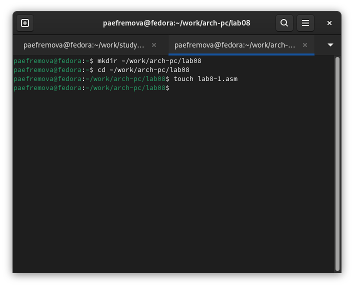{#fig:001 width=70%}

2. Ввожу в файл lab8-1.asm текст программы из листинга 8.1. (рис. [-@fig:002]). 

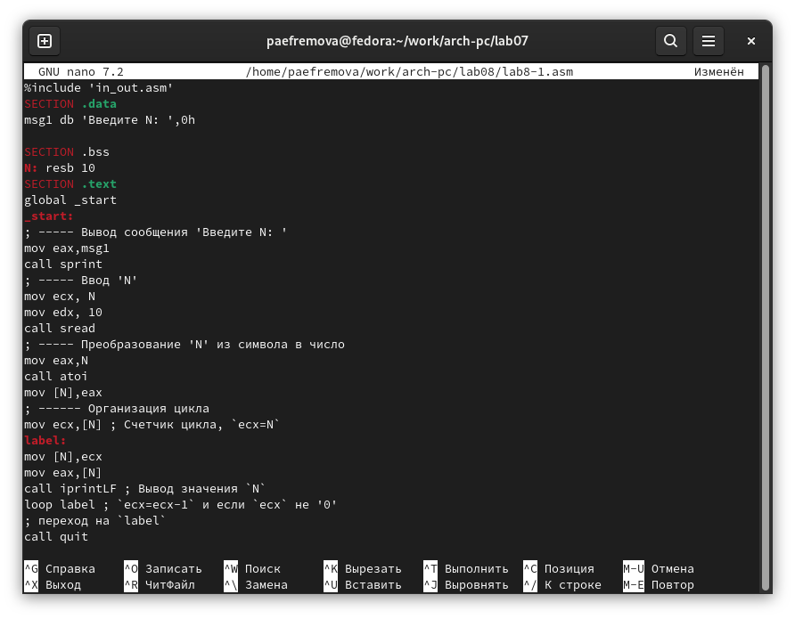{#fig:002 width=70%}

```NASM
%include 'in_out.asm'
SECTION .data
msg1 db 'Введите N: ',0h

SECTION .bss
N: resb 10
SECTION .text
global _start
_start:
; ----- Вывод сообщения 'Введите N: '
mov eax,msg1
call sprint
; ----- Ввод 'N'
mov ecx, N
mov edx, 10
call sread
; ----- Преобразование 'N' из символа в число
mov eax,N
call atoi
mov [N],eax
; ------ Организация цикла
mov ecx,[N] ; Счетчик цикла, `ecx=N`
label:
mov [N],ecx
mov eax,[N]
call iprintLF ; Вывод значения `N`
loop label ; `ecx=ecx-1` и если `ecx` не '0'
; переход на `label`
call quit
```

3. Cоздаю исполняемый файл и проверяю его работу. (рис. [-@fig:003]).

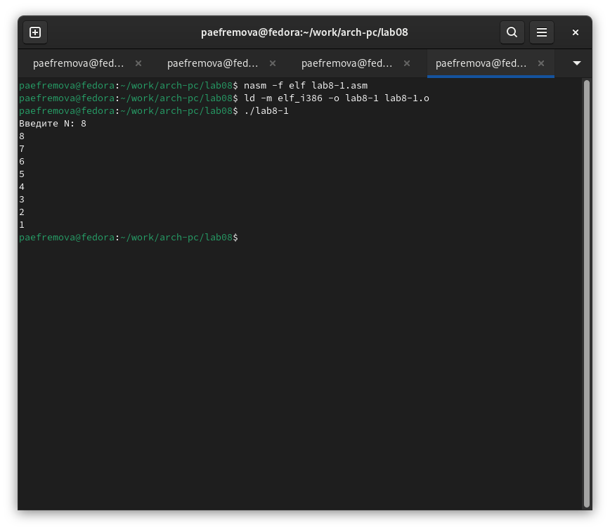{#fig:003 width=70%}


**Листинг 8.1. Программа вывода значений регистра ecx**


4. Изменяю текст программы, добавив изменение значение регистра ecx в цикле. (рис. [-@fig:004]) и (рис. [-@fig:005]).

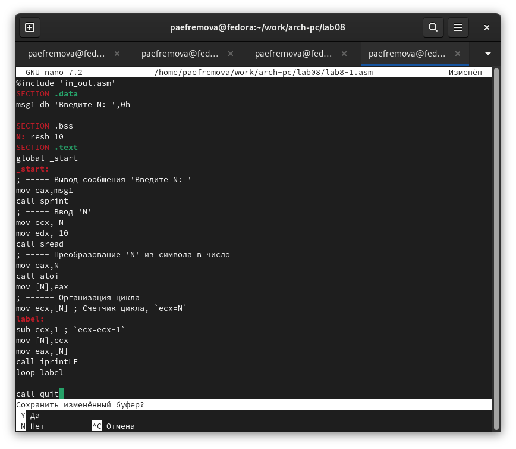{#fig:004 width=70%}

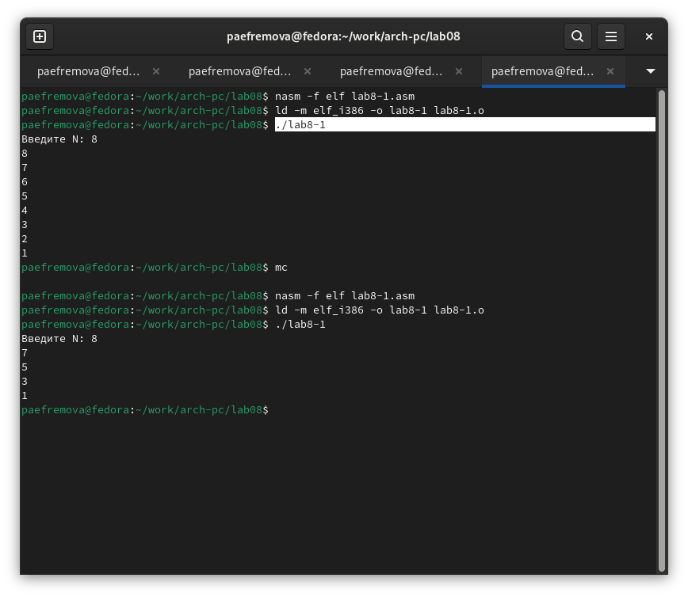{#fig:005 width=70%}

Внутри цикла, перед выводом, инструкция sub ecx, 1 уменьшает значение ecx на 1. Затем уменьшенное значение из ecx записывается обратно в переменную N (mov [N], ecx). 
Значение, которое находится в ecx (уменьшенное на 1) выводится на экран. Инструкция loop label уменьшает ecx еще на 1 и переходит к метке label, если ecx не равно 0.

Поэтому, число проходов цикла не соответствует значению N, введенному с клавиатуры. Цикл выполняется N раз, но значения, которые выводятся, это от N-1 до 1

5. Вношу изменения в текст программы добавив команды push и pop для сохранения значения счетчика цикла loop. (рис. [-@fig:006]) и (рис. [-@fig:007]). 

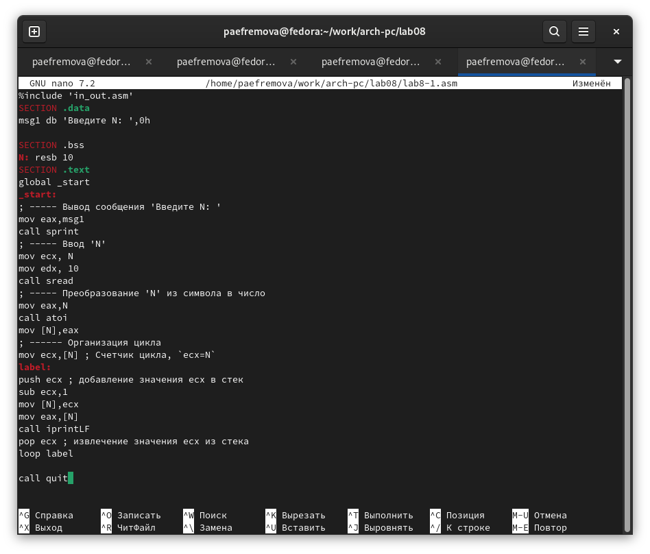{#fig:006 width=70%}

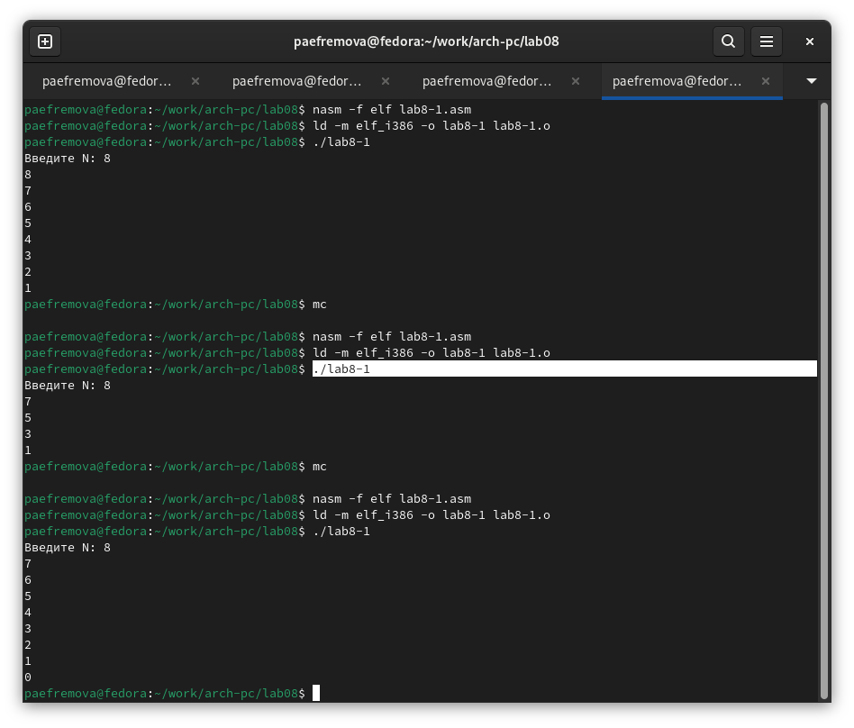{#fig:007 width=70%}

Цикл выполняется N раз, но инструкция loop уменьшает ecx на 1 перед проверкой на равенство нулю. Поэтому, если пользователь введет N, цикл будет выполняться N раз, но значения, которые выводятся, не будут от 1 до N. Вместо этого, будут выводиться числа от N-1 до 0, т.е N раз но со смещением на -1.

## Обработка аргументов командной строки

1. Создаю файл lab8-2.asm в каталоге ~/work/arch-pc/lab08. (рис. [-@fig:008]). 

{#fig:008 width=70%}


2. Ввожу в файл lab8-1.asm текст программы из листинга 8.1. (рис. [-@fig:009]). 

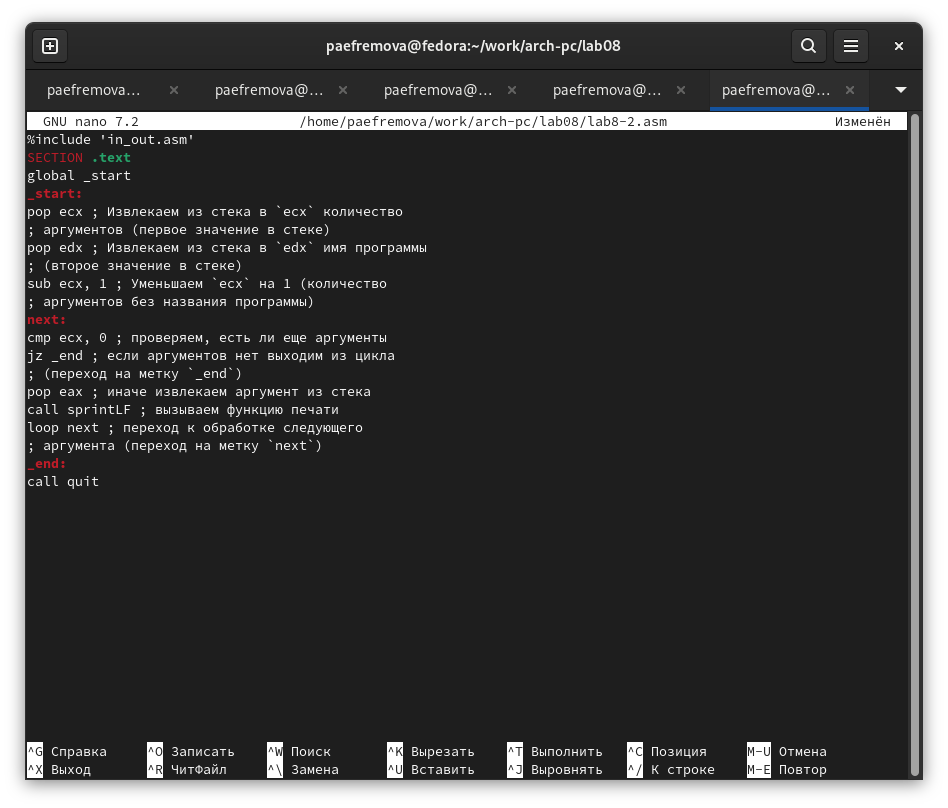{#fig:009 width=70%}

**Листинг 8.2. Программа выводящая на экран аргументы командной строки**

```NASM
%include 'in_out.asm'
SECTION .text
global _start
_start:
pop ecx ; Извлекаем из стека в `ecx` количество
; аргументов (первое значение в стеке)
pop edx ; Извлекаем из стека в `edx` имя программы
; (второе значение в стеке)
sub ecx, 1 ; Уменьшаем `ecx` на 1 (количество
; аргументов без названия программы)
next:
cmp ecx, 0 ; проверяем, есть ли еще аргументы
jz _end ; если аргументов нет выходим из цикла
; (переход на метку `_end`)
pop eax ; иначе извлекаем аргумент из стека
call sprintLF ; вызываем функцию печати
loop next ; переход к обработке следующего
; аргумента (переход на метку `next`)
_end:
call quit
```

3. Cоздаю исполняемый файл и проверяю его работу. (рис. [-@fig:010]).

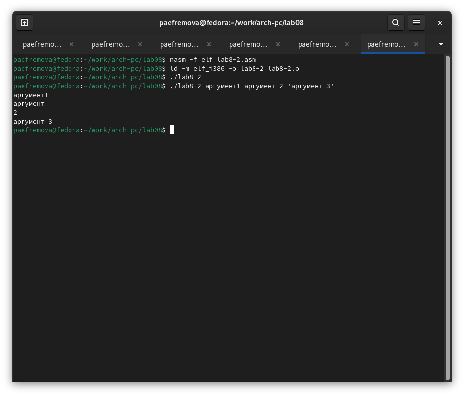{#fig:010 width=70%}

Программой было обработано то же количество аргументов, что и было введено. 

4. Создаю файл lab8-3.asm в каталоге ~/work/arch-pc/lab08. (рис. [-@fig:011]). 

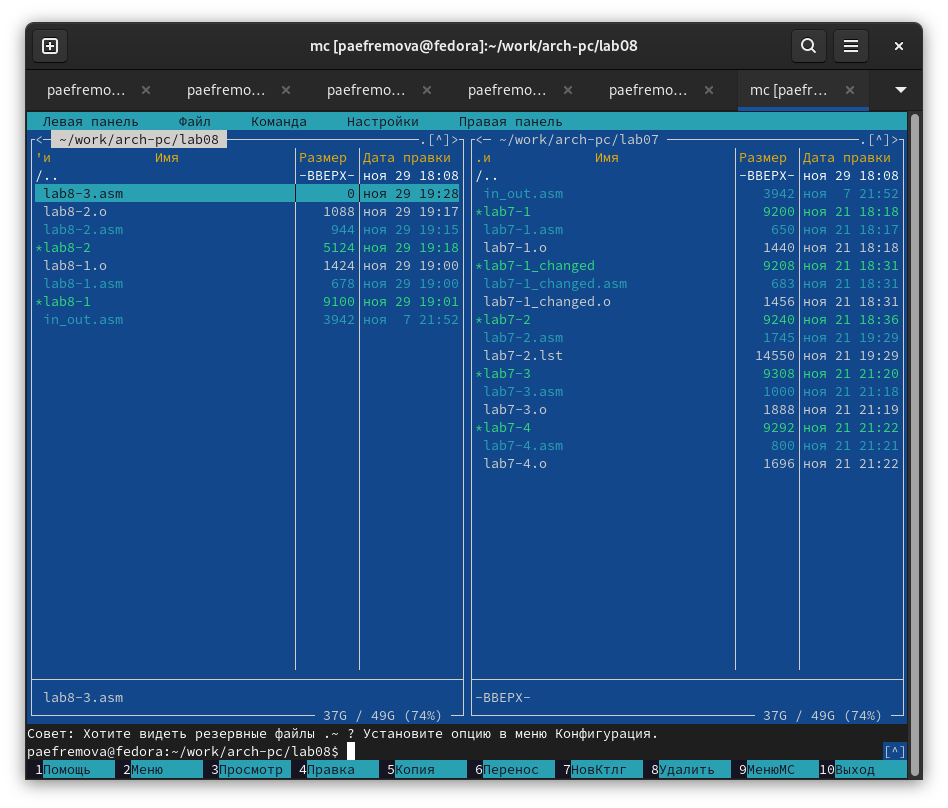{#fig:011 width=70%}


5. Ввожу в файл lab8-3.asm текст программы из листинга 8.1. (рис. [-@fig:012]). 

**Листинг 8.3. Программа вычисления суммы аргументов командной строки**

```NASM
%include 'in_out.asm'

SECTION .data
msg db "Результат: ",0

SECTION .text
global _start

_start:

pop ecx 

pop edx 
sub ecx,1 

mov esi, 0 

next:
cmp ecx,0h 
jz _end 

pop eax 
call atoi 
add esi,eax 

loop next 

_end:
mov eax, msg 
call sprint
mov eax, esi 
call iprintLF 
call quit 
```

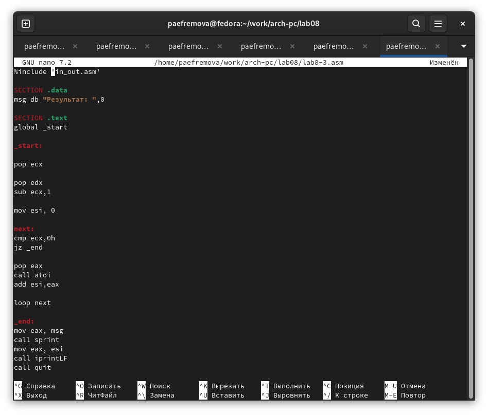{#fig:012 width=70%}

6. Cоздаю исполняемый файл и проверяю его работу. (рис. [-@fig:013]).

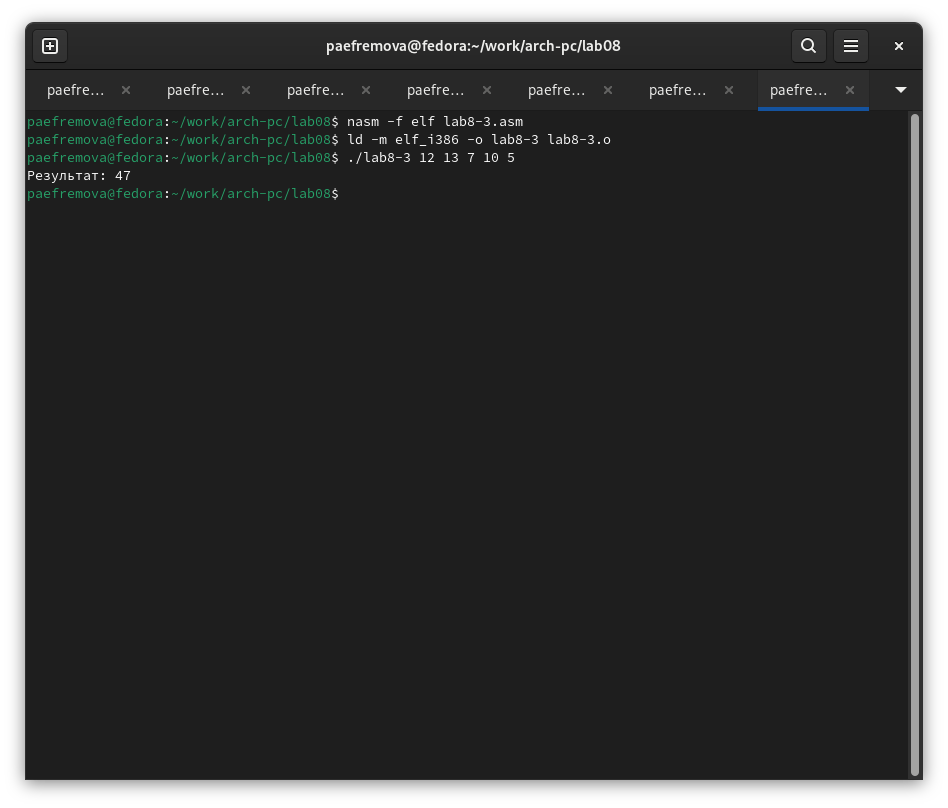{#fig:013 width=70%}

7. Изменяю исполняемый файл, чтобы аргументы умножались, а не складывались (рис. [-@fig:014]).

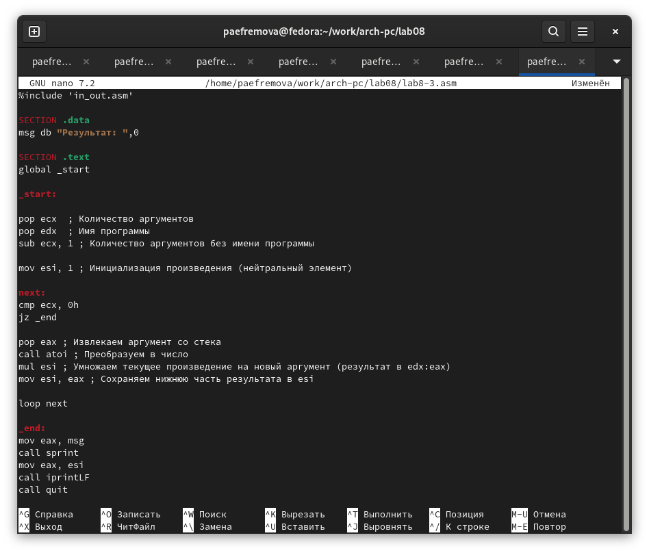{#fig:014 width=70%}

```NASM
%include 'in_out.asm'

SECTION .data
msg db "Результат: ",0

SECTION .text
global _start

_start:

pop ecx  ; Количество аргументов
pop edx  ; Имя программы
sub ecx, 1 ; Количество аргументов без имени программы

mov esi, 1 ; Инициализация произведения (нейтральный элемент)

next:
cmp ecx, 0h
jz _end

pop eax ; Извлекаем аргумент со стека
call atoi ; Преобразуем в число
mul esi ; Умножаем текущее произведение на новый аргумент (результат в edx:eax)
mov esi, eax ; Сохраняем нижнюю часть результата в esi

loop next

_end:
mov eax, msg
call sprint
mov eax, esi
call iprintLF
call quit
```
8. Cоздаю исполняемый файл и проверяю его работу. (рис. [-@fig:015]).

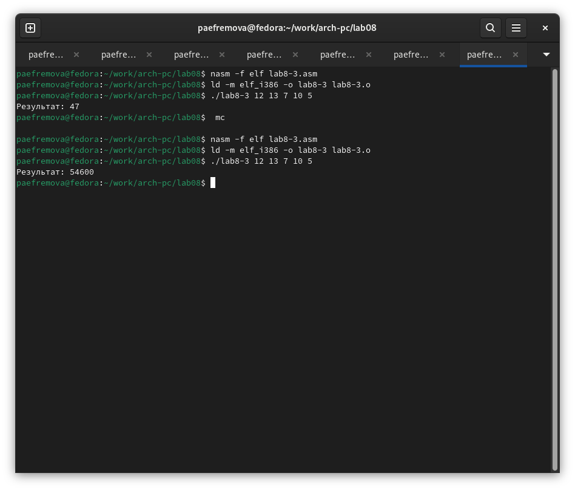{#fig:015 width=70%}

# Задание для самостоятельной работы.

1. Создаю файл для выполнения самостоятельного задания и открываю его. (рис. [-@fig:016]).

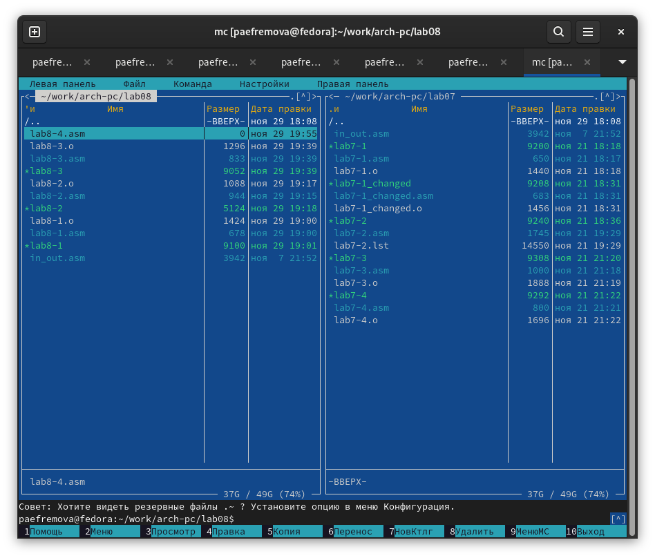{#fig:016 width=70%}

2. Ввожу программу для вычисления функции из варианта 5 (такой же вариант был для прошлых лабораторных) (рис. [-@fig:017]).

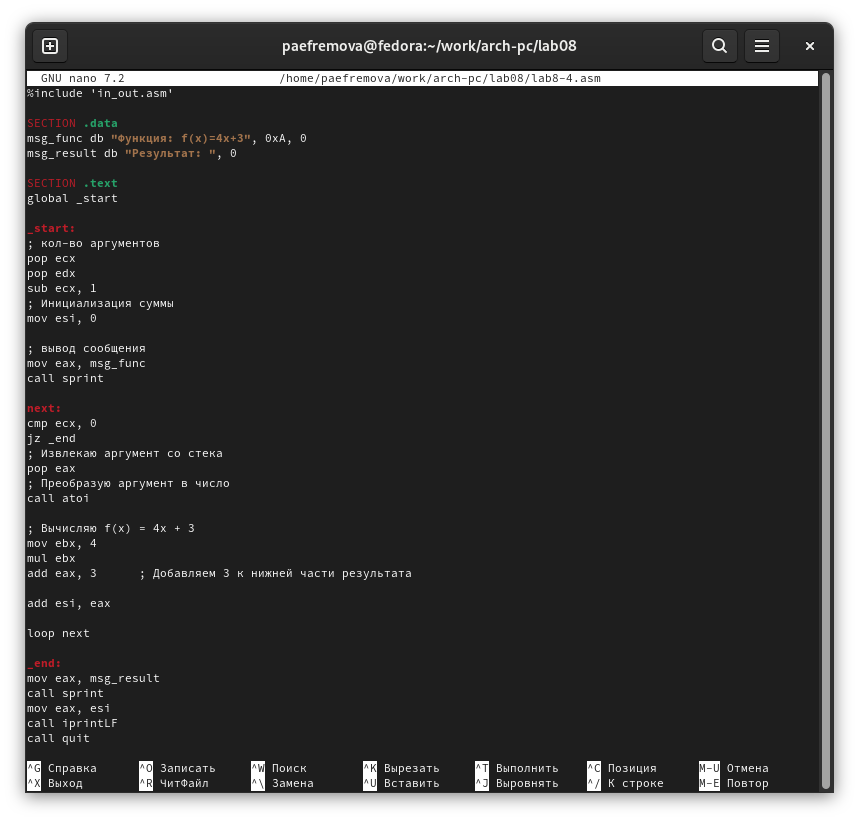{#fig:017 width=70%}

**Ниже прикрепляю сам код программы:**
```NASM
%include 'in_out.asm'

SECTION .data
msg_func db "Функция: f(x)=4x+3", 0xA, 0
msg_result db "Результат: ", 0

SECTION .text
global _start

_start:
; кол-во аргументов
pop ecx
pop edx
sub ecx, 1
; Инициализация суммы
mov esi, 0

; вывод сообщения
mov eax, msg_func
call sprint

next:
cmp ecx, 0
jz _end
; Извлекаю аргумент со стека
pop eax
; Преобразую аргумент в число
call atoi

; Вычисляю f(x) = 4x + 3
mov ebx, 4
mul ebx
add eax, 3	; Добавляем 3 к нижней части результата

add esi, eax

loop next

_end:
mov eax, msg_result
call sprint
mov eax, esi
call iprintLF
call quit
```
3. Запускаю программу, и вот что получилось (рис. [-@fig:018]).

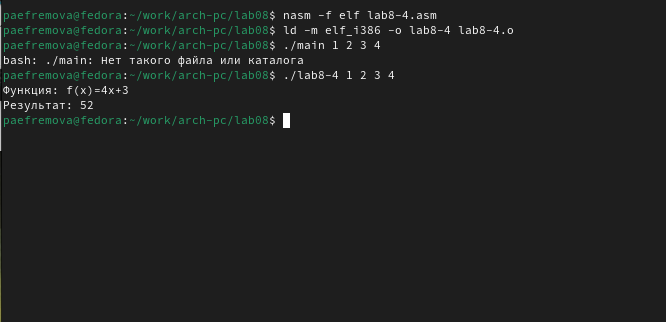{#fig:018 width=70%}

Ну и еще один пример работы программы (рис. [-@fig:019]).

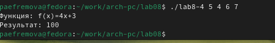{#fig:019 width=70%}

# Выводы

Благодаря данной лабораторной работе я научилась использовать большее количество команд на языке ассемблер. Теперь я знаю больше об организации стека, а также как добавлять и извлекать элементы оттуда. Мне понятна и инструкция организации циклов, а также их реализация. 

# Список литературы{.unnumbered}

1. [Лабораторная работа №8](https://esystem.rudn.ru/pluginfile.php/2089095/mod_resource/content/0/%D0%9B%D0%B0%D0%B1%D0%BE%D1%80%D0%B0%D1%82%D0%BE%D1%80%D0%BD%D0%B0%D1%8F%20%D1%80%D0%B0%D0%B1%D0%BE%D1%82%D0%B0%20%E2%84%968.%20%D0%9F%D1%80%D0%BE%D0%B3%D1%80%D0%B0%D0%BC%D0%BC%D0%B8%D1%80%D0%BE%D0%B2%D0%B0%D0%BD%D0%B8%D0%B5%20%D1%86%D0%B8%D0%BA%D0%BB%D0%B0.%20%D0%9E%D0%B1%D1%80%D0%B0%D0%B1%D0%BE%D1%82%D0%BA%D0%B0%20%D0%B0%D1%80%D0%B3%D1%83%D0%BC%D0%B5%D0%BD%D1%82%D0%BE%D0%B2%20%D0%BA%D0%BE%D0%BC%D0%B0%D0%BD%D0%B4%D0%BD%D0%BE%D0%B9%20%D1%81%D1%82%D1%80%D0%BE%D0%BA%D0%B8.pdf)
2. [Программирование на языке ассемблера NASM Столяров А. В.](https://esystem.rudn.ru/pluginfile.php/2088953/mod_resource/content/2/%D0%A1%D1%82%D0%BE%D0%BB%D1%8F%D1%80%D0%BE%D0%B2%20%D0%90.%20%D0%92.%20-%20%D0%9F%D1%80%D0%BE%D0%B3%D1%80%D0%B0%D0%BC%D0%BC%D0%B8%D1%80%D0%BE%D0%B2%D0%B0%D0%BD%D0%B8%D0%B5%20%D0%BD%D0%B0%20%D1%8F%D0%B7%D1%8B%D0%BA%D0%B5%20%D0%B0%D1%81%D1%81%D0%B5%D0%BC%D0%B1%D0%BB%D0%B5%D1%80%D0%B0%20NASM%20%D0%B4%D0%BB%D1%8F%20%D0%9E%D0%A1%20Unix.pdf)
3. [Cтек в ассемблере - использование команд push и pop](https://assembler-code.com/stek-v-assemblere-push-i-pop/)

::: {#refs}
:::
