---
## Front matter
title: "Выполнение лабораторной работы №9"
subtitle: "Дисциплина: Архитектура компьютера"
author: "Ефремова Полина Александровна"

## Generic otions
lang: ru-RU
toc-title: "Содержание"

## Bibliography
bibliography: bib/cite.bib
csl: pandoc/csl/gost-r-7-0-5-2008-numeric.csl

## Pdf output format
toc: true # Table of contents
toc-depth: 2
lof: true # List of figures
lot: true # List of tables
fontsize: 12pt
linestretch: 1.5
papersize: a4
documentclass: scrreprt
## I18n polyglossia
polyglossia-lang:
  name: russian
  options:
	- spelling=modern
	- babelshorthands=true
polyglossia-otherlangs:
  name: english
## I18n babel
babel-lang: russian
babel-otherlangs: english
## Fonts
mainfont: IBM Plex Serif
romanfont: IBM Plex Serif
sansfont: IBM Plex Sans
monofont: IBM Plex Mono
mathfont: STIX Two Math
mainfontoptions: Ligatures=Common,Ligatures=TeX,Scale=0.94
romanfontoptions: Ligatures=Common,Ligatures=TeX,Scale=0.94
sansfontoptions: Ligatures=Common,Ligatures=TeX,Scale=MatchLowercase,Scale=0.94
monofontoptions: Scale=MatchLowercase,Scale=0.94,FakeStretch=0.9
mathfontoptions:
## Biblatex
biblatex: true
biblio-style: "gost-numeric"
biblatexoptions:
  - parentracker=true
  - backend=biber
  - hyperref=auto
  - language=auto
  - autolang=other*
  - citestyle=gost-numeric
## Pandoc-crossref LaTeX customization
figureTitle: "Рис."
tableTitle: "Таблица"
listingTitle: "Листинг"
lofTitle: "Список иллюстраций"
lotTitle: "Список таблиц"
lolTitle: "Листинги"
## Misc options
indent: true
header-includes:
  - \usepackage{indentfirst}
  - \usepackage{float} # keep figures where there are in the text
  - \floatplacement{figure}{H} # keep figures where there are in the text
---

# Цель работы

Приобретение навыков написания программ с использованием подпрограмм. Знакомство
с методами отладки при помощи GDB и его основными возможностями.

# Задание

1. Реализация подпрограмм в NASM
2. Отладка программ с помощью GDB
3. Самостоятельное выполнение заданий по материалам лабораторной работы

# Теоретическое введение

Отладка — это процесс поиска и исправления ошибок в программе. В общем случае его
можно разделить на четыре этапа:


• обнаружение ошибки;
• поиск её местонахождения;
• определение причины ошибки;
• исправление ошибки.


Можно выделить следующие типы ошибок:


• синтаксические ошибки — обнаруживаются во время трансляции исходного кода и
вызваны нарушением ожидаемой формы или структуры языка;
• семантические ошибки — являются логическими и приводят к тому, что программа
запускается, отрабатывает, но не даёт желаемого результата;
• ошибки в процессе выполнения — не обнаруживаются при трансляции и вызывают пре-
рывание выполнения программы (например, это ошибки, связанные с переполнением
или делением на ноль).


Второй этап — поиск местонахождения ошибки. Некоторые ошибки обнаружить доволь-
но трудно. Лучший способ найти место в программе, где находится ошибка, это разбить
программу на части и произвести их отладку отдельно друг от друга.


Третий этап — выяснение причины ошибки. После определения местонахождения ошибки
обычно проще определить причину неправильной работы программы.
Последний этап — исправление ошибки. После этого при повторном запуске программы,
может обнаружиться следующая ошибка, и процесс отладки начнётся заново.

# Выполнение лабораторной работы

## Реализация подпрограмм в NASM

1. Создаю файл в папке для программ лабораторной работы №9 (рис. [-@fig:001]).

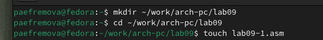{#fig:001 width=70%}

2. В созданный файл вставляю программу с листинга 9.1 (рис. [-@fig:002]).

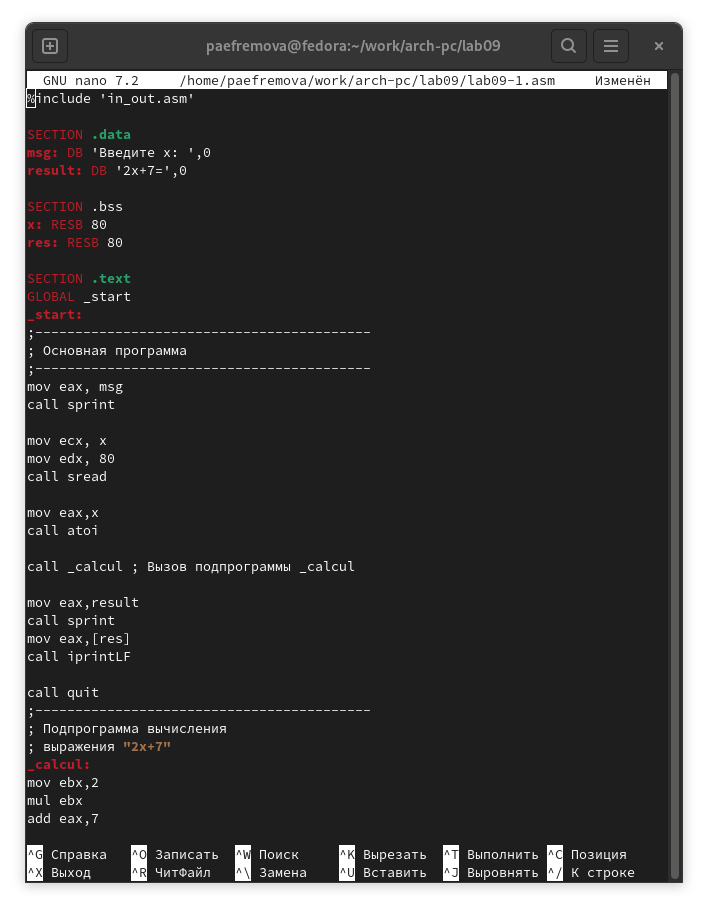{#fig:002 width=70%}

**Листинг 9.1. Пример программы с использованием вызова подпрограммы**

```NASN
%include 'in_out.asm'

SECTION .data
msg: DB 'Введите x: ',0
result: DB '2x+7=',0

SECTION .bss
x: RESB 80
res: RESB 80

SECTION .text
GLOBAL _start
_start:
;------------------------------------------
; Основная программа
;------------------------------------------
mov eax, msg
call sprint

mov ecx, x
mov edx, 80
call sread

mov eax,x
call atoi

call _calcul ; Вызов подпрограммы _calcul

mov eax,result
call sprint
mov eax,[res]
call iprintLF

call quit
;------------------------------------------
; Подпрограмма вычисления
; выражения "2x+7"
_calcul:
mov ebx,2
mul ebx
add eax,7
mov [res],eax

ret ; выход из подпрограммы
```
3. Теперь запускаю программу и проверяю ее работу (рис. [-@fig:003]).

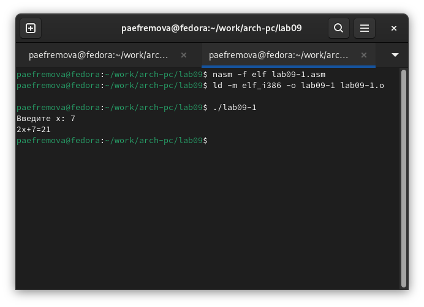{#fig:003 width=70%}

4. Меняю код программы так, чтобы вычислить $𝑓(𝑔(𝑥))$, где 𝑥 вводится с клавиатуры, $𝑓(𝑥) = 2𝑥 + 7$, $𝑔(𝑥) =
3𝑥 − 1.$ Т.е. 𝑥 передается в подпрограмму _calcul из нее в подпрограмму _subcalcul, где
вычисляется выражение $𝑔(𝑥)$, результат возвращается в _calcul и вычисляется выражение
$𝑓(𝑔(𝑥))$. Результат возвращается в основную программу для вывода результата на экран. (рис. [-@fig:004]).

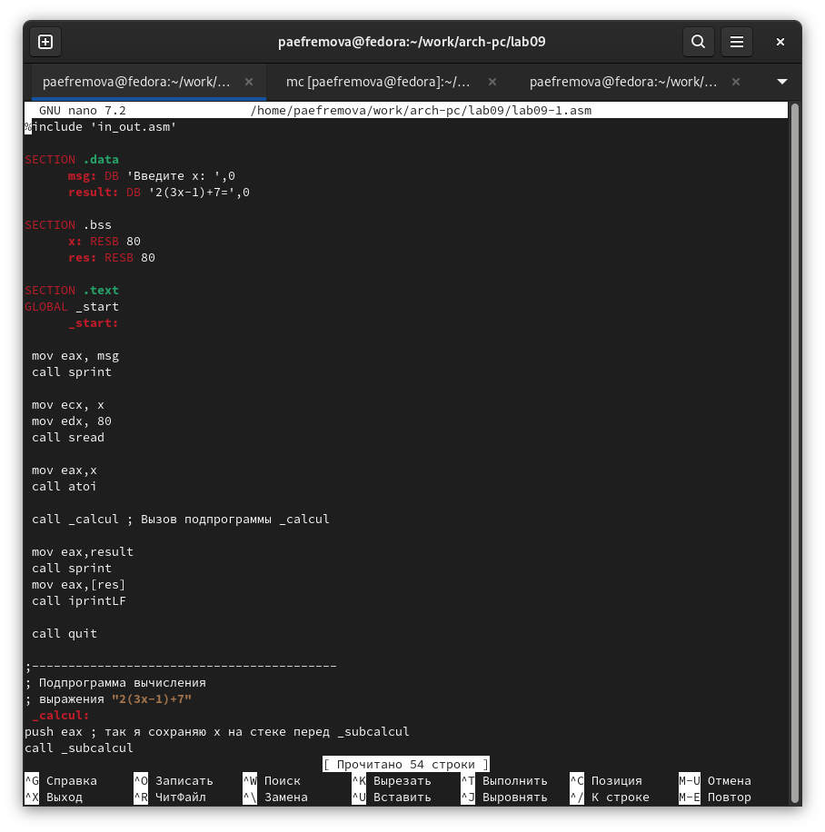{#fig:004 width=70%}

5. Теперь проверю программу на точность работы (рис. [-@fig:005]).

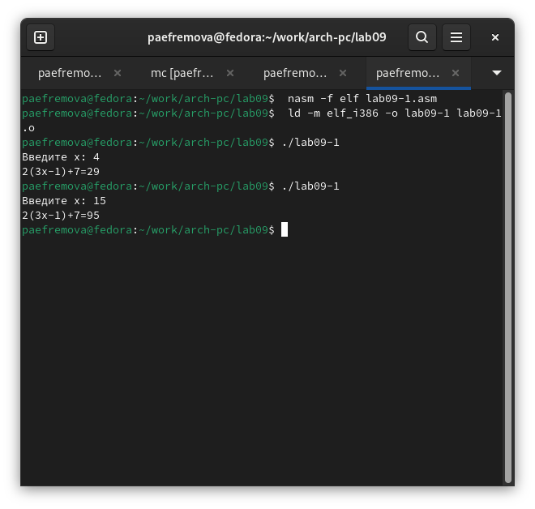{#fig:005 width=70%}


Ниже прикрепляю текст измененной программы:

```NASM
%include 'in_out.asm'

SECTION .data
      msg: DB 'Введите x: ',0
      result: DB '2(3x-1)+7=',0

SECTION .bss
      x: RESB 80
      res: RESB 80

SECTION .text
GLOBAL _start
      _start:

 mov eax, msg
 call sprint

 mov ecx, x
 mov edx, 80
 call sread

 mov eax,x
 call atoi

 call _calcul ; Вызов подпрограммы _calcul

 mov eax,result
 call sprint
 mov eax,[res]
 call iprintLF

 call quit

;------------------------------------------
; Подпрограмма вычисленияПриобретение навыков написания программ с использованием подпрограмм. Знакомство
с методами отладки при помощи GDB и его основными возможностями.

; выражения "2(3x-1)+7"
 _calcul:
push eax ; так я сохраняю x на стеке перед _subcalcul
call _subcalcul

mov ebx,2
mul ebx      ; 2 * (3x - 1)
add eax,7    ; 2(3x - 1) + 7
mov [res],eax ; Сохраняю результат в res
pop eax ; Получаю  результат из _subcalcul 
ret

;------------------------------------------
; Подпрограмма вычисления 3x - 1
_subcalcul:
mov ebx,3
mul ebx      ; 3x
sub eax,1    ; 3x - 1
ret
```
## Отладка программам с помощью GDB

6. Создаю файл lab09-2.asm с текстом программы из Листинга 9.2. (рис. [-@fig:006]).

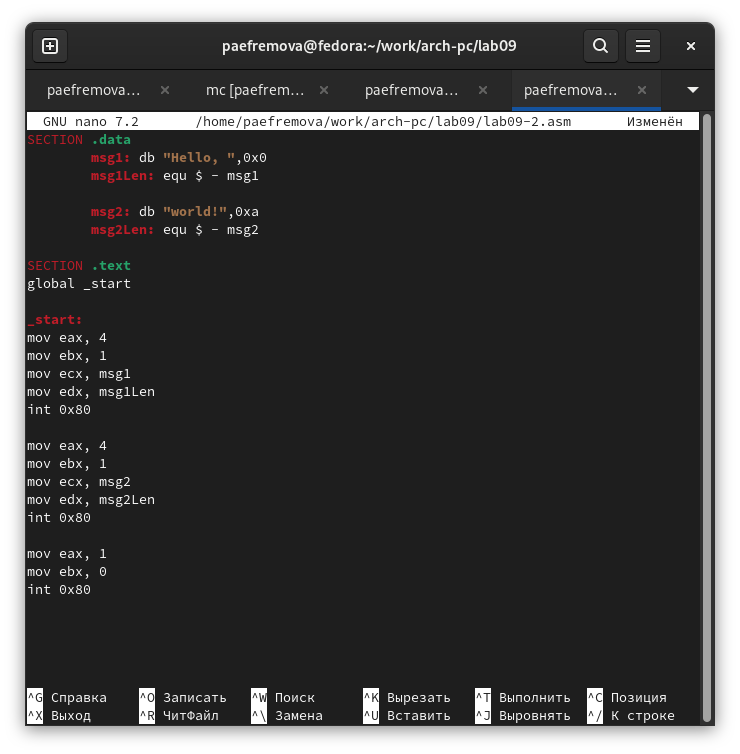{#fig:006 width=70%}

Текст программы:
```NASM
SECTION .data
        msg1: db "Hello, ",0x0
        msg1Len: equ $ - msg1

        msg2: db "world!",0xa
        msg2Len: equ $ - msg2

SECTION .text
global _start

_start:
mov eax, 4
mov ebx, 1
mov ecx, msg1
mov edx, msg1Len
int 0x80

mov eax, 4
mov ebx, 1
mov ecx, msg2
mov edx, msg2Len
int 0x80

mov eax, 1
mov ebx, 0
int 0x80
```
7. Для работы с GDB в исполняемый файл необходимо добавить отладочную информацию, для этого трансляцию программ необходимо проводить с ключом
‘-g’. (рис. [-@fig:007]).

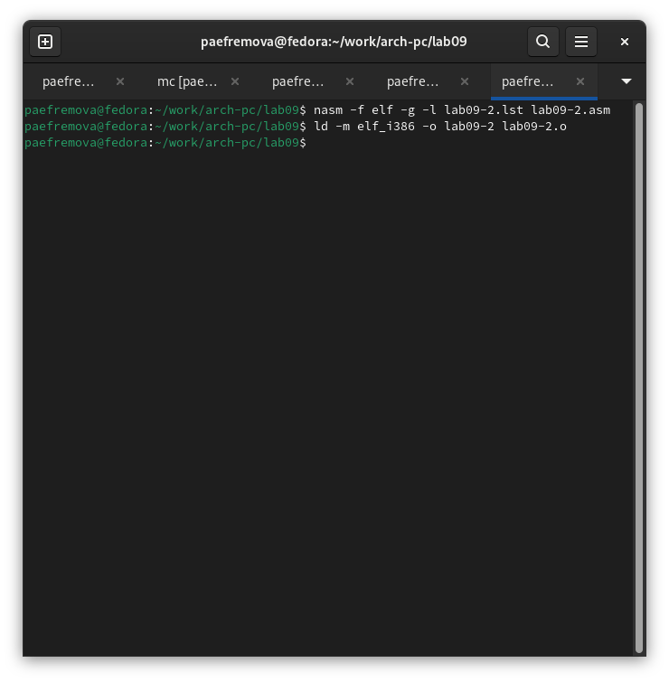{#fig:007 width=70%}

8. Загружаю исполняемый файл в отладчик gdb. (рис. [-@fig:008]).

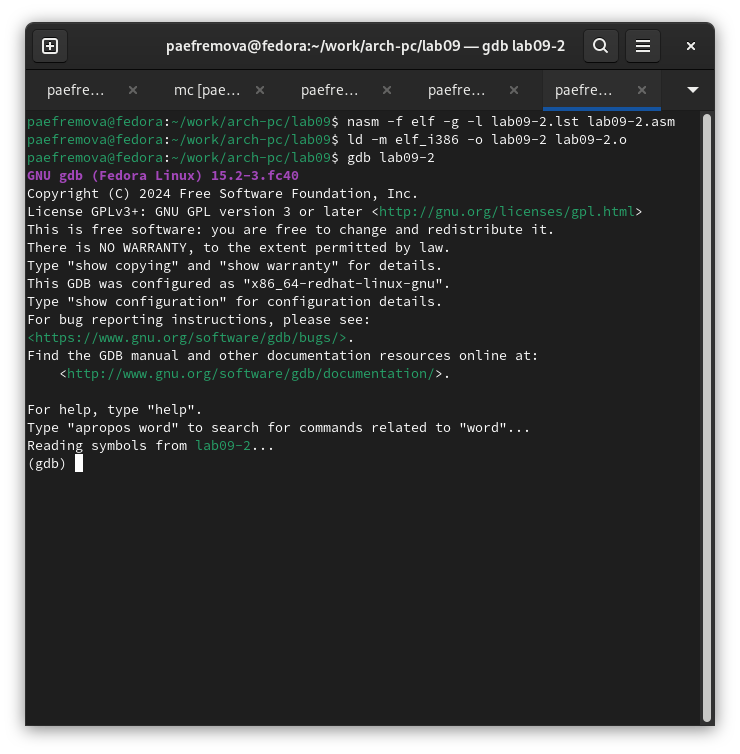{#fig:008 width=70%}

9. Проверяю работу программы, запустив ее в оболочке GDB с помощью команды run (сокращённо r) (рис. [-@fig:009]).

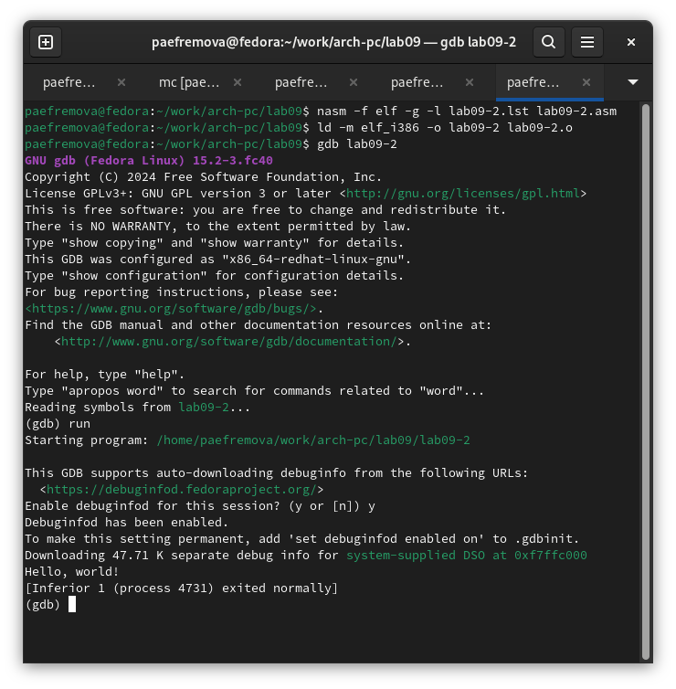{#fig:009 width=70%}

10. Для более подробного анализа программы установливаю брейкпоинт на метку _start, с которой начинается выполнение любой ассемблерной программы, и запускаю её. (рис. [-@fig:010]).

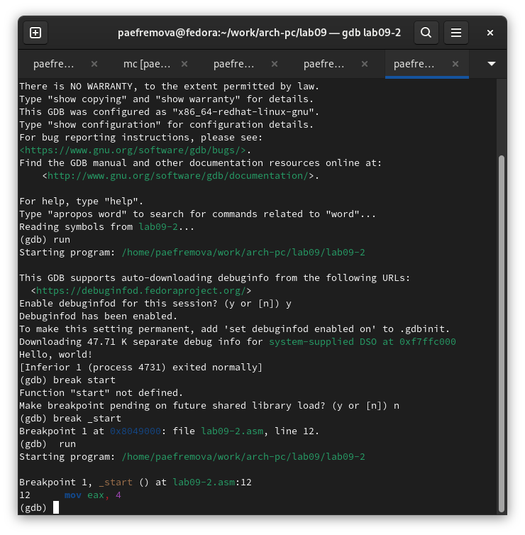{#fig:010 width=70%}

11. Посмотрю дисассимилированный код программы с помощью команды disassemble, начиная с метки _start (рис. [-@fig:011]).

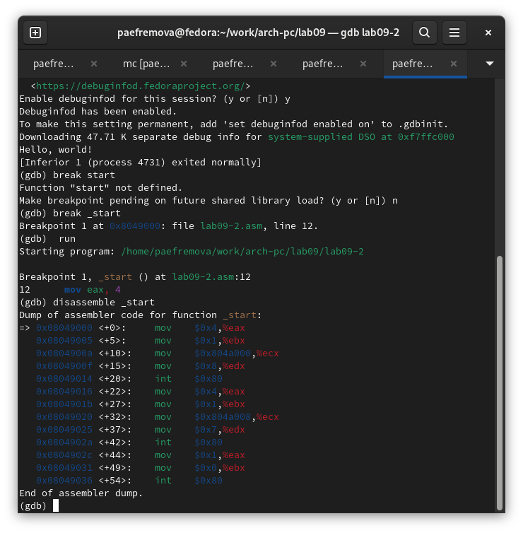{#fig:011 width=70%}

12. Переключаюсь на отображение команд с Intel’овским синтаксисом, введя команду set disassembly-flavor intel (рис. [-@fig:012]).

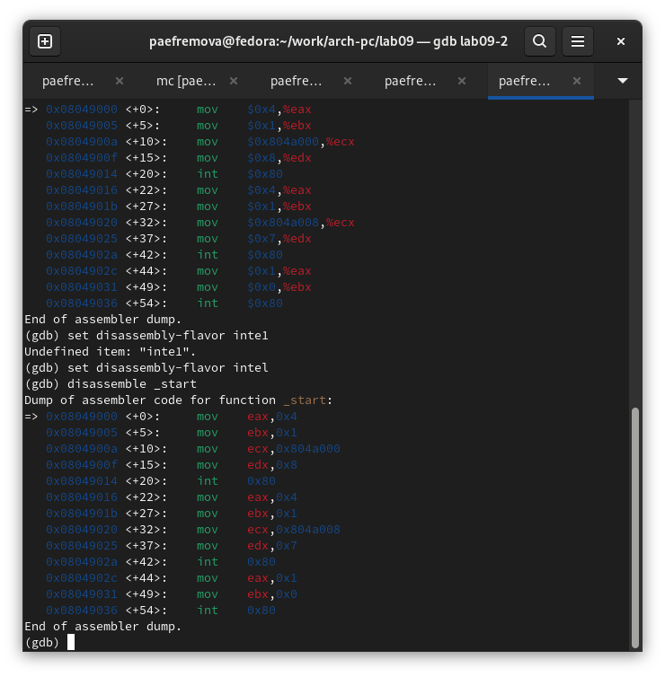{#fig:012 width=70%}

Теперь посмотрим на различия отображения синтаксиса машинных команд в режимах ATT и Intel:

**Порядок операндов:** Intel: назначение, источник; ATT: источник, назначение.

**Регистры:** Intel: eax; ATT: %eax.

**Размер операндов:**(TT - pазмер операндов указывается явно с помощью суффиксов, Intel - Размер операндов неявно определяется контекстом.

**Константы:** Intel: mov eax, 10; ATT: mov $10, %eax.

Главное отличие — порядок операндов.

13. Включу режим псевдографики для более удобного анализа программы (рис. [-@fig:013]).

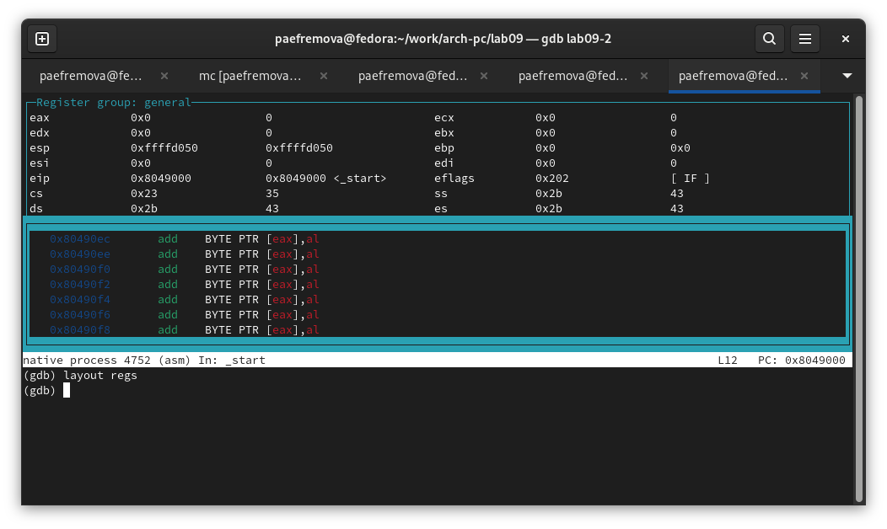{#fig:013 width=70%}

### Добавление точек останова

С помощью i b (info breakpoints) убеждаюсь в том, что создала первую точку break. 

14. Теперь установлю еще одну точку останова по адресу инструкции и ввожу i b, которая показывает, что обе точки останова созданы. (рис. [-@fig:014]).

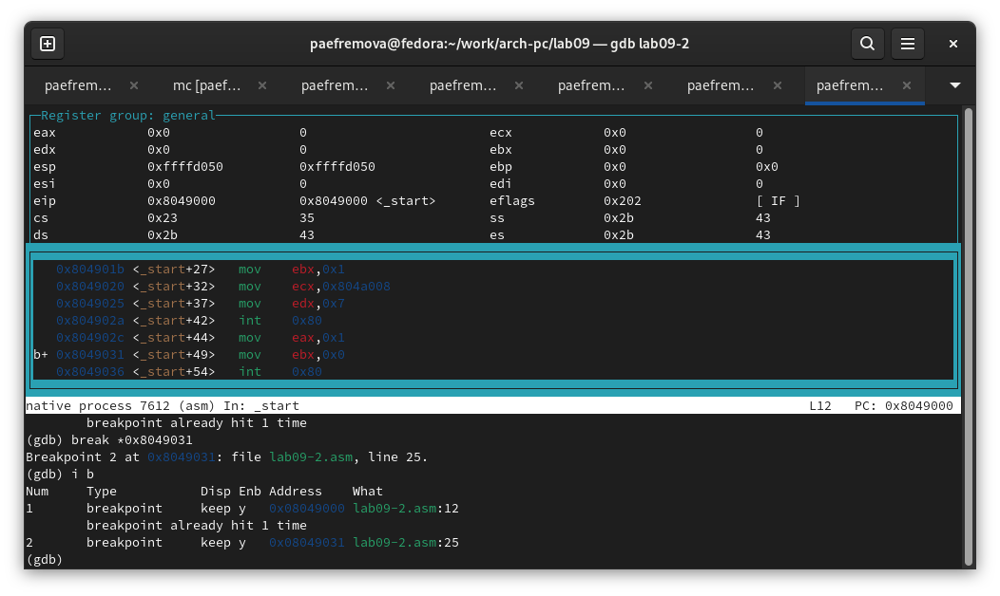{#fig:014 width=70%}

### Работа с данными программы в GDB

15. Выполнила 5 инструкций с помощью команды stepi (или si) и проследила за изменением значений регистров. Поменялось значение регистра ecx,0x804a008. Я поняла изменения так, каждый раз выводится значение последнего обработанного регистра (крайнего). Если ввести i r для регистра, который находится после текущего положения и(иногда) в текущем положении, то значение регистра будет засчитано как 0. Ниже прикрепила скрин того, как выполняла это. (рис. [-@fig:015]).

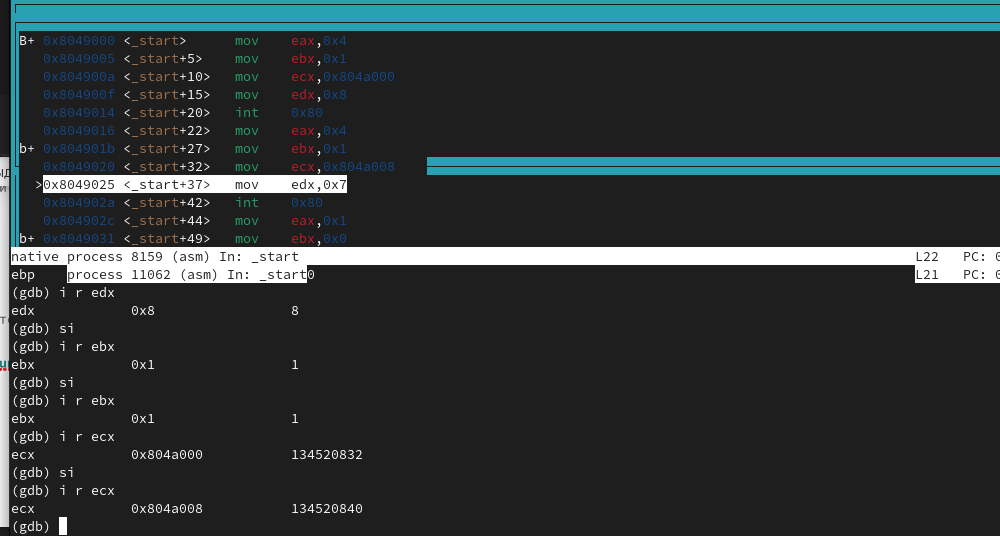{#fig:015 width=70%}

16. Просмотр содержимого регистров. (рис. [-@fig:016]).

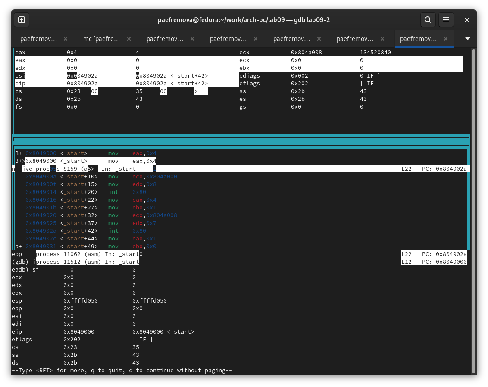{#fig:016 width=70%}

17. Смотрю содержимое переменных по имени и по адресу (рис. [-@fig:017]).

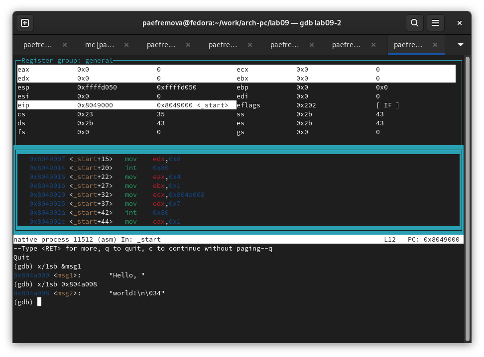{#fig:017 width=70%}

18. Меняю содержимое переменных по имени и по адресу. (рис. [-@fig:018]).

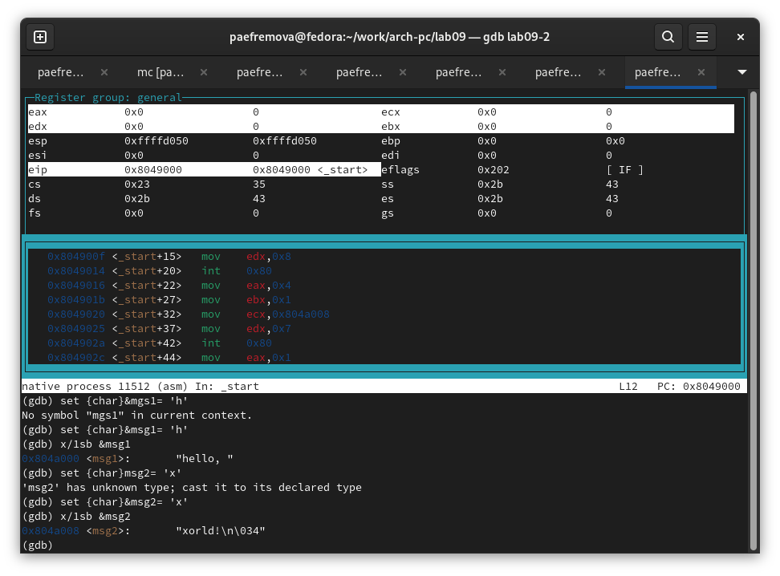{#fig:018 width=70%}

19. Вывожу в различных форматах значение регистра edx. (рис. [-@fig:019]).

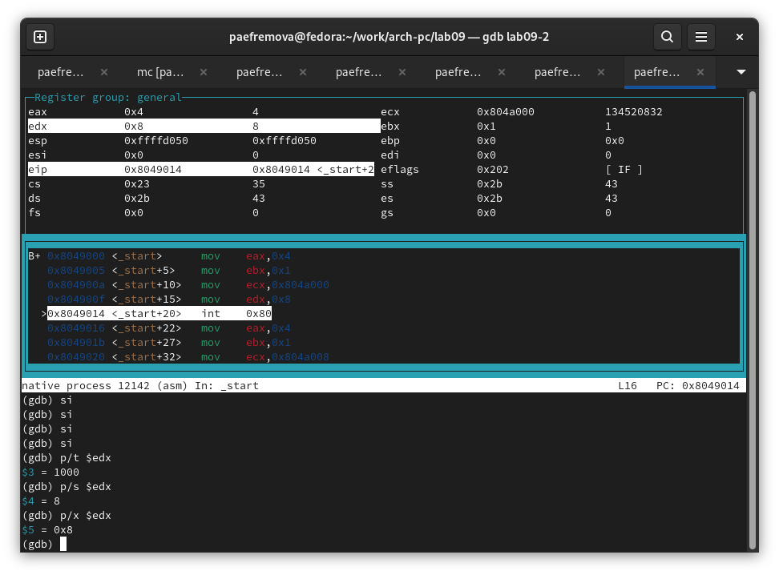{#fig:019 width=70%}

20. С помощью команды set изменяю значение регистра ebx (рис. [-@fig:020]).

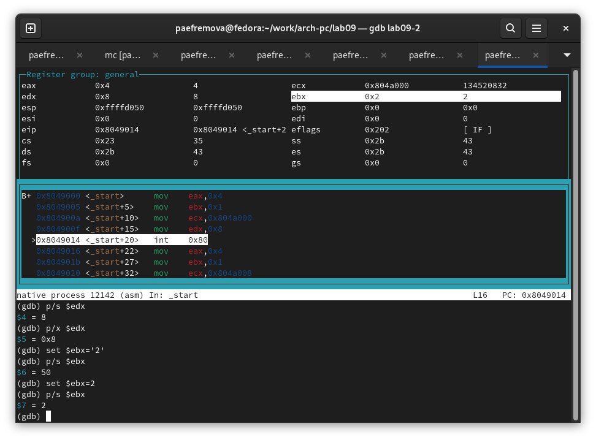{#fig:020 width=70%}

Команда p/s $ebx не имеет единственного “правильного” вывода. Результат полностью зависит от того, что содержится в регистре ebx. Только если ebx указывает на действительный нуль-терминированный массив символов в памяти, вы увидите осмысленный вывод. 

Завершаю выполнение программы с помощью команды continue (сокращенно c)  и выхожу из GDB с помощью команды quit (сокращенно q)

21. Копирую файл lab8-2.asm, созданный при выполнении лабораторной работы №8,
с программой выводящей на экран аргументы командной строки (Листинг 8.2) в файл с
именем lab09-3.asm. А также создаю исполняемый файл. (рис. [-@fig:021]).

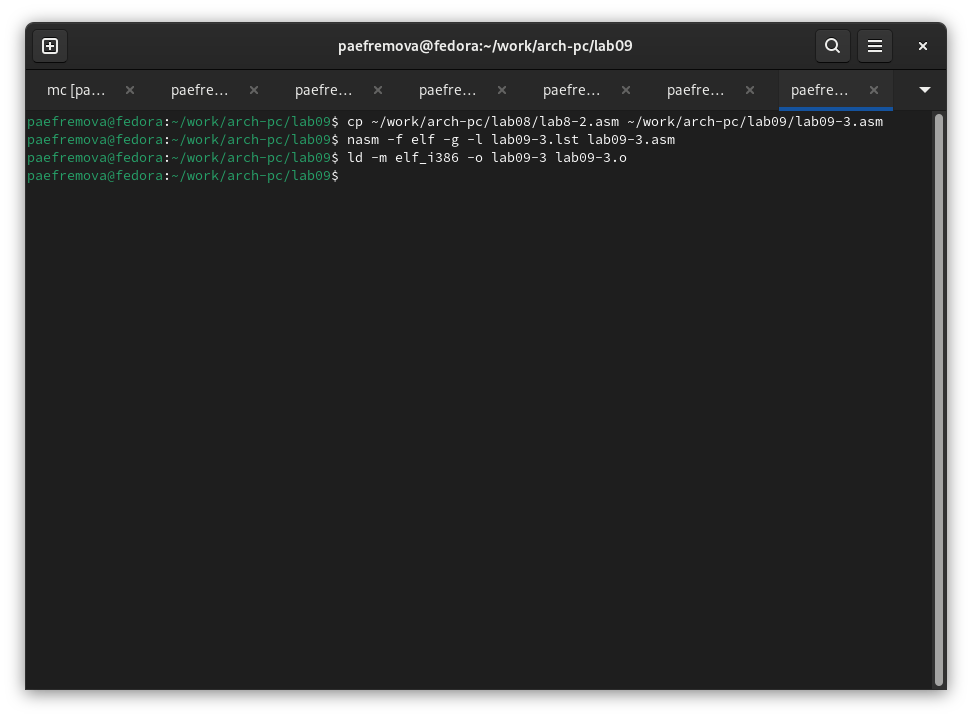{#fig:021 width=70%}

22. Загрузите исполняемый файл в отладчик, указав аргументы. Затем установим точку останова перед первой инструкцией в программе и запустим. Адрес вершины стека храниться в регистре esp и по этому адресу располагается число равное количеству аргументов командной строки (включая имя программы)
ее. Посмотрю остальные позиции стека – по адесу [esp+4] располагается адрес в памяти где находиться имя программы, по адесу [esp+8] храниться адрес первого аргумента, по
аресу [esp+12] – второго и т.д (рис. [-@fig:022]). 

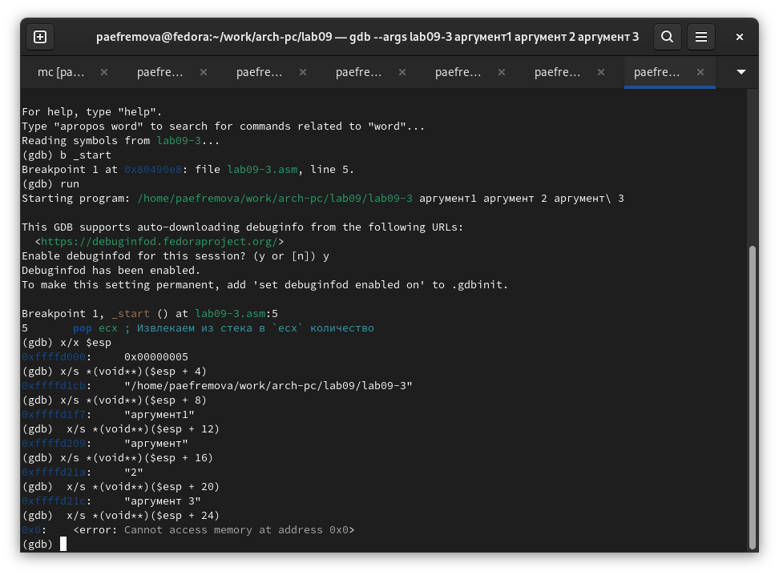{#fig:022 width=70%}

Шаг изменения адреса, равный 4 байтам в выражениях типа [esp+4], [esp+8], [esp+12] и т.д., обусловлен размером указателя (и большинства других основных типов данных) в 32-битных архитектурах.

## Задание для самостоятельной работы 

1. Меняю программу самостоятельной части предыдущей лабораторной работы с использованием подпрограммы( рис. [-@fig:023]). 

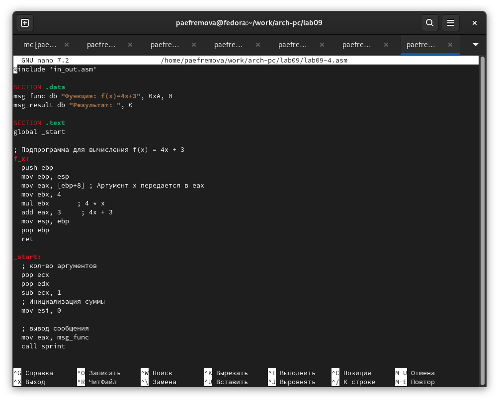{#fig:023 width=70%}

Вот код программы:
```NASM
%include 'in_out.asm'

SECTION .data
msg_func db "Функция: f(x)=4x+3", 0xA, 0
msg_result db "Результат: ", 0

SECTION .text
global _start

; Подпрограмма для вычисления f(x) = 4x + 3
f_x:
  push ebp
  mov ebp, esp
  mov eax, [ebp+8] ; Аргумент x передается в eax
  mov ebx, 4
  mul ebx       ; 4 * x
  add eax, 3     ; 4x + 3
  mov esp, ebp
  pop ebp
  ret

_start:
  ; кол-во аргументов
  pop ecx
  pop edx
  sub ecx, 1
  ; Инициализация суммы
  mov esi, 0

  ; вывод сообщения
  mov eax, msg_func
  call sprint

next:
  cmp ecx, 0
  jz _end
  ; Извлекаю аргумент со стека
  pop eax
  ; Преобразую аргумент в число
  push eax
  call atoi
  add esp, 4

  ; Вычисляю f(x) используя подпрограмму
  push eax
  call f_x
  add esp, 4

  add esi, eax ; Добавляем результат функции к сумме

  loop next

_end:
  mov eax, msg_result
  call sprint
  mov eax, esi
  call iprintLF
  call quit
```

2. В листинге 9.3 приведена программа вычисления выражения (3+ 2)*4 + 5. При запуске
данная программа дает неверный результат. Проверяю это. 
Для этого создаю файл, куда ввожу программу из листинга 9.3. Запускаю и проверяю.  ( рис. [-@fig:024]). 

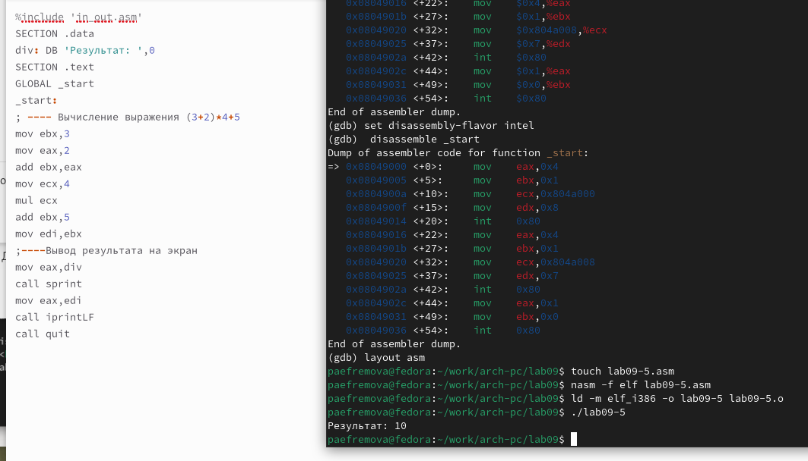{#fig:024 width=70%}

Код программы с ошибкой:

```NASM
%include 'in_out.asm'
SECTION .data
div: DB 'Результат: ',0
SECTION .text
GLOBAL _start
_start:
; ---- Вычисление выражения (3+2)*4+5
mov ebx,3
mov eax,2
add ebx,eax
mov ecx,4
mul ecx
add ebx,5
mov edi,ebx
;----Вывод результата на экран
mov eax,div
call sprint
mov eax,edi
call iprintLF
call quit
```


С помощью отладчика GDB, анализируя изменения значений регистров, определяю ошибку и исправляю ее.. При выполнении инструкции mul ecx можно заметить, что результат умножения записывается в регистр eax, но также меняет и edx. Значение регистра ebx не обновляется напрямую, поэтому результат программа неверно подсчитывает функцию. ( рис. [-@fig:025]). 

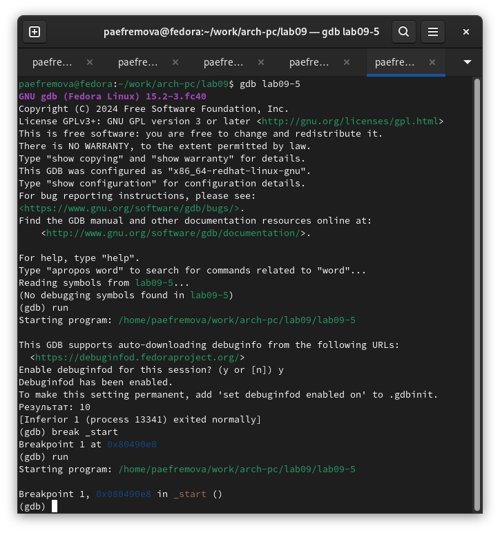{#fig:025 width=70%}

Теперь исправлю это недоразумение 
Вот текст исправленной программы:

```NASM
%include 'in_out.asm'

SECTION .data
div: DB 'Результат: ', 0

SECTION .text
GLOBAL _start
_start:

mov ebx, 3
mov eax, 2
add ebx, eax
mov eax, ebx
mov ecx, 4
mul ecx
add eax, 5
mov edi, eax

mov eax, div
call sprint
mov eax, edi
call iprintLF

call quit
```
Теперь проверяю изменения! ( рис. [-@fig:026]). 

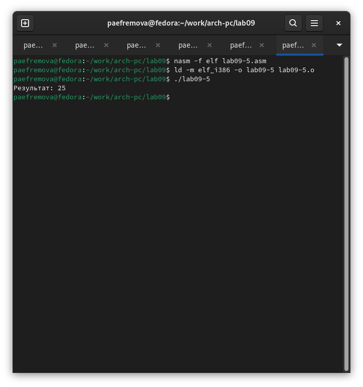{#fig:026 width=70%}

# Выводы

В результате выполнения данной лабораторной работы я приобрела навыки написания программ с использованием подпрограмм, а так же познакомилась с методами отладки при поомщи GDB и его основными возможностями.

# Список литературы{.unnumbered}

1. [Курс на ТУИС](https://esystem.rudn.ru/course/view.php?id=112)
2. [Лабораторная работа №9](https://esystem.rudn.ru/pluginfile.php/2089096/mod_resource/content/0/%D0%9B%D0%B0%D0%B1%D0%BE%D1%80%D0%B0%D1%82%D0%BE%D1%80%D0%BD%D0%B0%D1%8F%20%D1%80%D0%B0%D0%B1%D0%BE%D1%82%D0%B0%20%E2%84%969.%20%D0%9F%D0%BE%D0%BD%D1%8F%D1%82%D0%B8%D0%B5%20%D0%BF%D0%BE%D0%B4%D0%BF%D1%80%D0%BE%D0%B3%D1%80%D0%B0%D0%BC%D0%BC%D1%8B.%20%D0%9E%D1%82%D0%BB%D0%B0%D0%B4%D1%87%D0%B8%D0%BA%20.pdf)


::: {#refs}
:::
